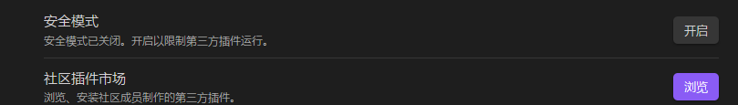
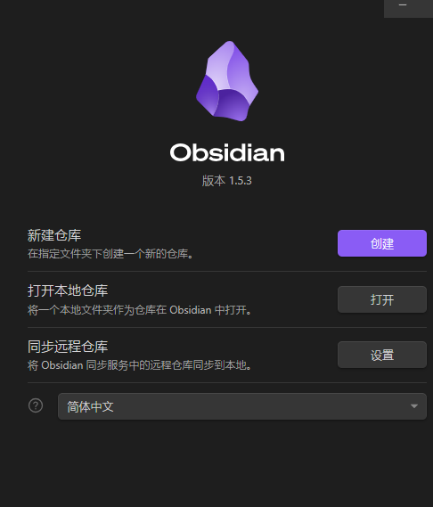
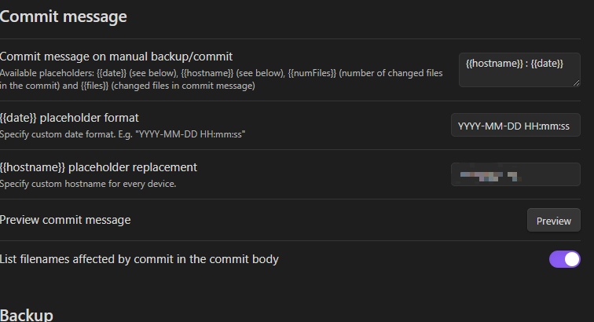

## hexo配置
### node.js配置
### hexo主题配置
## Obsidian配置
下载`Obsidian Git`插件，需要打开第三方插件按钮，下载插件。

在对应的.git目录下打开仓库，下图的打开本地仓库，生成本地目录。

配置Git设置地址等，这样就可以调用后台的git自动推送了

> 需要注意的是：git需要首先被安装，并且配置到环境变量
> 
## github配置
### workflows配置
## dependabot配置
