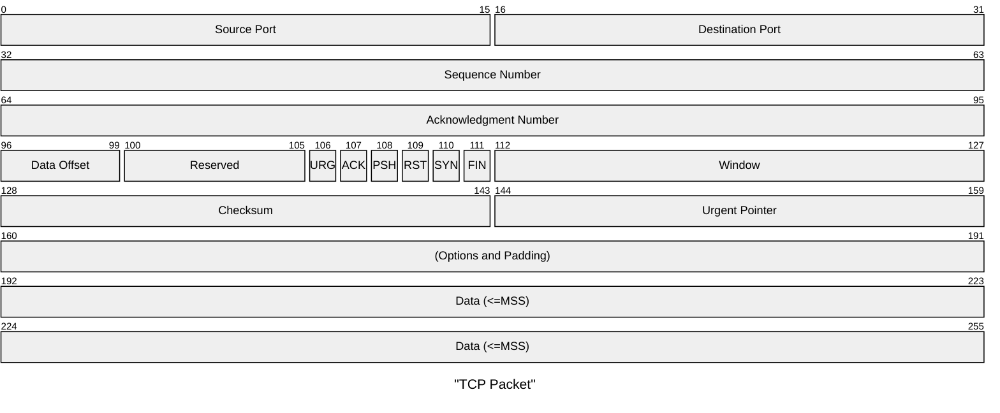

# 报文格式

## 以太网物理帧

| 字段     | 长度     | 含义                                                                                                                                                                               |
| ------ | ------ | -------------------------------------------------------------------------------------------------------------------------------------------------------------------------------- |
| 帧间隙    | 至少12字节 | 每个以太帧之间都要有帧间隙（Inter Frame Gap），即每发完一个帧后要等待一段时间才能再发另外一个帧，以便让帧接收者对接收的帧做必要的处理（如调整缓存的指针、更新计数、通知对报文进行处理等等）。在以太网标准中规定最小帧间隙是12个字节，其数据为全1。对于个别的接口，可减少到64(GE)或40比特(10GE)，其他的接口都不应该小于12字节。 |
| 前同步码   | 7字节    | 以太网标准中规定前导码为10101010 10101010 10101010 10101010 10101010 10101010 10101010（二进制），共7字节。                                                                                            |
| 帧开始定界符 | 1字节    | 以太网标准中规定帧开始定界符为10101011（二进制），共1字节。                                                                                                                                               |
## 以太网帧头

| 字段   | 长度        | 含义                                                                                                                                                                                                        |
| ---- | --------- | --------------------------------------------------------------------------------------------------------------------------------------------------------------------------------------------------------- |
| DMAC | 6字节       | 目的MAC地址，IPv4为6字节，该字段标识帧的接收者。                                                                                                                                                                              |
| SMAC | 6字节       | 源MAC地址，IPv4为6字节，该字段标识帧的发送者。                                                                                                                                                                               |
| Type | 2字节       | 协议类型。[表1-3](https://support.huawei.com/enterprise/zh/doc/EDOC1100174722/ea0a043c#ethII_tab_3)列出了链路直接封装的协议类型。                                                                                              |
| Data | 46～1500字节 | 数据字段，标识帧的负载（可能包含填充位）。  数据字段的最小长度必须为46字节以保证帧长至少为64字节，这意味着传输1字节信息也必须使用46字节的数据字段。  如果填入该字段的信息少于46字节，该字段的其余部分也必须进行填充。数据字段的最大长度为1500字节。  以太帧的长度必须为整数字节，因此帧的负载长度不足整数字节，需插入填充字段以保证数据帧的长度为整数字节。 |
| FCS  | 4字节       | 帧校验序列FCS（Frame Check Sequence）是为接收者提供判断是否传输错误的一种方法，如果发现错误，丢弃此帧。  FCS只是通用叫法，具体的FCS还可以细分多种校验方法。在以太帧中，FCS通常采用循环冗余码校验CRC（Cyclical Redundancy Check）。                                                    |
## TCP报文头

| 字段                    | 长度   | 含义                                                                                                                                                                                                                                                                                                                                                                                        |
| --------------------- | --------  | -------------------------------------------------------------------------------------------------------------------------------------------------------------------------------------------------------------------------------------------------------------------------------------------------------------------------------------------------------------------------------- |
| Source Port           | 16比特 | 源端口，标识哪个应用程序发送。                                                                                                                                                                                                                                                                                                                                                                           |
| Destination Port      | 16比特 | 目的端口，标识哪个应用程序接收。                                                                                                                                                                                                                                                                                                                                                                          |
| Sequence Number       | 32比特 | 序号字段。TCP链接中传输的数据流中每个字节都编上一个序号。序号字段的值指的是本报文段所发送的数据的第一个字节的序号。                                                                                                                                                                                                                                                                                                                               |
| Acknowledgment Number | 32比特 | 确认号，是期望收到对方的下一个报文段的数据的第1个字节的序号，即上次已成功接收到的数据字节序号加1。只有ACK标识为1，此字段有效。                                                                                                                                                                                                                                                                                                                        |
| Data Offset           | 4比特  | 数据偏移，即首部长度，指出TCP报文段的数据起始处距离TCP报文段的起始处有多远，以32比特（4字节）为计算单位。最多有60字节的首部，若无选项字段，正常为20字节。                                                                                                                                                                                                                                                                                                       |
| Reserved              | 4比特  | 保留，必须填0。                                                                                                                                                                                                                                                                                                                                                                                  |
| CWR                   | 1比特  | 拥塞窗口减少标识                                                                                                                                                                                                                                                                                                                                                                                  |
| ECE                   | 1比特  | ECN回声标识                                                                                                                                                                                                                                                                                                                                                                                   |
| URG                   | 1比特  | 紧急指针有效标识。它告诉系统此报文段中有紧急数据，应尽快传送（相当于高优先级的数据）。                                                                                                                                                                                                                                                                                                                                               |
| ACK                   | 1比特  | 确认序号有效标识。只有当ACK=1时确认号字段才有效。当ACK=0时，确认号无效。                                                                                                                                                                                                                                                                                                                                                 |
| PSH                   | 1比特  | 标识接收方应该尽快将这个报文段交给应用层。接收到PSH = 1的TCP报文段，应尽快的交付接收应用进程，而不再等待整个缓存都填满了后再向上交付。                                                                                                                                                                                                                                                                                                                  |
| RST                   | 1比特  | 重建连接标识。当RST=1时，表明TCP连接中出现严重错误（如由于主机崩溃或其他原因），必须释放连接，然后再重新建立连接。                                                                                                                                                                                                                                                                                                                             |
| SYN                   | 1比特  | 同步序号标识，用来发起一个连接。SYN=1表示这是一个连接请求或连接接受请求。                                                                                                                                                                                                                                                                                                                                                   |
| FIN                   | 1比特  | 发端完成发送任务标识。用来释放一个连接。FIN=1表明此报文段的发送端的数据已经发送完毕，并要求释放连接。                                                                                                                                                                                                                                                                                                                                     |
| Window                | 16比特 | 窗口：TCP的流量控制，窗口起始于确认序号字段指明的值，这个值是接收端期望接收的字节数。窗口最大为65535字节。                                                                                                                                                                                                                                                                                                                                 |
| Checksum              | 16比特 | 校验字段，包括TCP首部和TCP数据，是一个强制性的字段，一定是由发端计算和存储，并由收端进行验证。在计算检验和时，要在TCP报文段的前面加上12字节的伪首部。                                                                                                                                                                                                                                                                                                          |
| Urgent Pointer        | 16比特 | 紧急指针，只有当URG标志置1时紧急指针才有效。TCP的紧急方式是发送端向另一端发送紧急数据的一种方式。紧急指针指出在本报文段中紧急数据共有多少个字节（紧急数据放在本报文段数据的最前面）。                                                                                                                                                                                                                                                                                            |
| Options               | 可变   | 选项字段。TCP协议最初只规定了一种选项，即最长报文段长度（只包含数据字段，不包括TCP首部），又称为MSS。MSS告诉对方TCP“我的缓存所能接收的报文段的数据字段的最大长度是MSS个字节”。  新的RFC规定有以下几种选型：选项表结束，空操作，最大报文段长度，窗口扩大因子，时间戳。  -  选项表结束。 - 空操作：没有特殊含义，一般用于将TCP选项的总长度填充为4字节的整数倍。 - 最大报文段长度：又称为MSS，只包含数据字段，不包括TCP首部。 - 窗口扩大因子：3字节，其中一个字节表示偏移值S。新的窗口值等于TCP首部中的窗口位数增大到（16+S），相当于把窗口值向左移动S位后获得实际的窗口大小。 - 时间戳：10字节，其中最主要的字段是时间戳值（4字节）和时间戳回送应答字段（4字节）。 |
| data                  | 可变   | TCP负载。小于等于MSS                                                                                                                                                                                                                                                                                                                                                                             |

# MTU、MSS、PMTU和分片

以太网的MTU 1500B、PPPoE 1492B、ATM 9180B。TCP中分割之后的段叫TCP报文段，这时候能够使用的最大报文段称为MSS。

$$
(P)MTU=IP head+TCP head+MSS
$$

TCP需要获取PMTU大小，用来规划自己的MSS，PMTU是通过IP层的ICMP协议获取的。分片是IP层完成的事情，如果TCP MSS规划不合理，那么送到IP层的报文依旧存在大报文，会走IP分片报文。

$$
f(x)=\left\{
\begin{array}{**lr**}
3n+1&x为奇数且x\neq1\\
n/2&x为偶数\\
1&x=1
\end{array}
\right.
$$