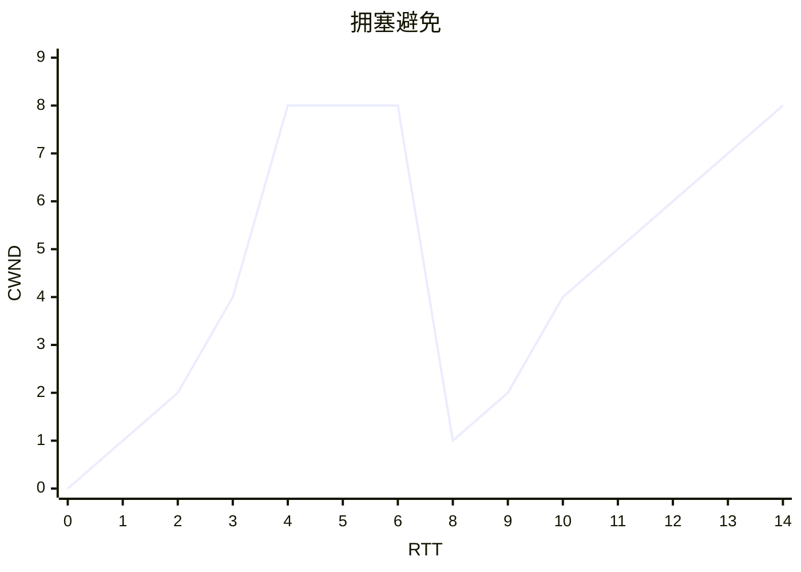
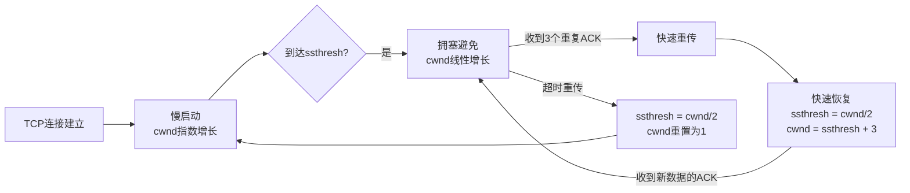

# TCP几个窗口概念

TCP窗口大小的单位是**字节**​ 。这意味着窗口大小衡量的是可以发送的**数据字节数**，而不是报文段或帧的数量。

下表总结了TCP通信中几个关键的窗口类型：

|窗口类型|英文全称|控制方|核心作用|
|---|---|---|---|
|**接收窗口 (RWND)**​|Receiver Window|接收端|流量控制，反映接收方应用程序的缓存剩余空间|
|**拥塞窗口 (CWND)**​|Congestion Window|发送端|拥塞控制，根据网络状况动态调整，避免造成网络过载|
|**发送窗口 (SWND)**​|Sender Window|发送端|**实际发送数据的上限**，其大小由RWND和CWND共同决定|

- **为何以字节为单位**：采用字节作为单位提供了极大的灵活性，允许TCP适应各种不同的应用需求（如大文件传输或短小交互命令），而不受底层网络数据包大小分割的限制 。核心目的是实现**流量控制**，确保发送方的发送速率不会超过接收方的处理能力 。
- **流量控制过程**：接收方通过TCP报文首部中的16位“窗口大小”字段，动态地向发送方通告自己的接收窗口剩余容量 。如果接收方缓冲区已满，它会通告一个**零窗口**，此时发送方会暂停发送，并通过**持续计时器**定时发送窗口探测报文，以等待接收方缓冲区空出后恢复传输 。
- **窗口大小的限制与扩展**：由于窗口字段是16位，理论上最大窗口值为65535字节。对于高带宽、高延迟的网络（如卫星链路），这可能成为瓶颈。因此，TCP使用了**窗口缩放选项**，通过一个缩放因子，可以将实际窗口大小最大扩展到约1GB，从而显著提高吞吐量 。

# 窗口之间的关系

$$
SWND=\min(CWND, RWND)
$$

# CWND

CWND是为了避免TCP拥塞产生的，以“不清楚网络情况”为前提，使用几种算法来探测和避免拥塞的。

- 慢启动
- 拥塞避免
- 快速恢复

## 慢启动

收到一个ACK，就将CWND的值增加一个MSS。那么在几轮RTT的表现下，CWND的增加呈现指数级增长。

$$
CWND=CWND+MSS
$$

```mermaid
xychart-beta
        title "慢启动"
        x-axis "RTT" [0, 1, 2, 3, 4, 5, 6]
        y-axis "CWND" 
        line [1, 2, 4, 8, 16, 32, 64]
```

## 拥塞避免

TCP的拥塞避免是TCP拥塞控制算法的核心阶段之一，其主要目的是在网络接近饱和时，平稳地利用带宽，避免因数据注入过快而导致网络拥塞。

$$
CWND=CWND+MSS/CWND
$$
比如原始的cwnd为8时发生了拥塞和重传，那么RTT-cwnd的图如下


## 快速恢复

TCP快速恢复是拥塞控制中一项关键机制，它的核心目标是在检测到数据包丢失后（通常是收到三个重复确认ACK），**避免让连接退回到慢启动阶段**，从而维持较高的网络吞吐量。下面这个表格可以快速抓住演进的精髓。

| 特性          | TCP Tahoe                             | TCP Reno                                          | TCP NewReno                        | TCP with SACK                  |
| ----------- | ------------------------------------- | ------------------------------------------------- | ---------------------------------- | ------------------------------ |
| **核心机制**​   | 仅有快速重传                                | 快速重传 + 基础快速恢复                                     | 改进的快速恢复（应对多包丢失）                    | 选择性确认 + 更精确的恢复                 |
| **触发条件**​   | 3个重复ACK或超时                            | 3个重复ACK                                           | 3个重复ACK                            | 3个重复ACK（利用SACK信息）              |
| **主要动作**​   | `ssthresh = cwnd/2`, `cwnd = 1`，进入慢启动 | `ssthresh = cwnd/2`, `cwnd = ssthresh + 3`，进入快速恢复 | `ssthresh = cwnd/2`，持续重传直至所有丢失包被确认 | 基于SACK信息精确重传丢失包，使用`pipe`变量控制发送 |
| **多包丢失处理**​ | 效率低，引发多次重置                            | 效率低，可能多次进入恢复或超时                                   | **显著改善**，可在一次恢复期内重传多个丢失包           | **最优**，能同时识别和重传多个丢失包           |
| **主要优势**​   | 实现简单                                  | 避免空窗，提升单包丢失恢复效率                                   | 有效处理同一窗口内多个包丢失，减少超时                | 恢复最精确、延迟最低，吞吐量高                |
| **主要局限**​   | 网络利用率低，震荡大                            | 多包丢失时性能差，易致超时                                     | 每个RTT只能恢复一个丢失包                     | 实现复杂，CPU开销相对高                  |

### 深入理解工作原理

快速恢复机制建立在几个关键原则和步骤之上：
1. **触发与初始化**：当发送端连续收到**3个重复的ACK**时，会推断有数据包丢失，从而触发快速恢复。随后，它会将慢启动阈值（`ssthresh`）设置为当前拥塞窗口（`cwnd`）的一半（但不小于2），为恢复阶段设定新的窗口上限。此时，拥塞窗口（`cwnd`）会被设置为新的 `ssthresh`值加上3个MSS（最大报文段长度），即 `cwnd = ssthresh + 3 * MSS`。加3是因为收到3个重复ACK，意味着有3个数据包已经离开网络，可以为新数据或重传数据腾出空间。
2. **“数据包守恒”原则**：这是快速恢复阶段的核心思想。在恢复期间，每收到一个重复的ACK，就意味着又有一个数据包被成功接收（尽管是乱序的），发送方就可以再发送一个新数据包（无论是重传丢失包还是发送新数据）。因此，`cwnd`会随着重复ACK的到达而线性增加（通常每个重复ACK使 `cwnd`增加1个MSS），以此维持网络中的数据流量，避免管道完全排空。
3. **恢复完成与退出**：当发送端收到一个**确认了新数据的ACK**（即序列号高于触发快速恢复的那个ACK）时，意味着此次丢失的数据包已被成功重传并确认，恢复阶段结束。此时，`cwnd`会被设置为 `ssthresh`的值，然后TCP连接进入**拥塞避免**阶段，`cwnd`开始线性增长。

### 算法演进与比较

不同的TCP版本对快速恢复的实现有所差异，了解其演进有助于理解为何NewReno和SACK更为高效：

- **Tahoe的局限**：TCP Tahoe版本仅有快速重传而没有快速恢复。一旦检测到丢包（3个重复ACK或超时），无论原因为何，它都会将 `cwnd`重置为1，并重新进入慢启动阶段。这种“一刀切”的方式在非严重拥塞的随机丢包情况下会**严重降低网络利用率**，造成吞吐量急剧下降。
- **Reno的改进与不足**：TCP Reno引入了快速恢复阶段，在单数据包丢失场景下表现良好。但其主要缺陷在于处理**同一发送窗口内多个数据包丢失**时显得力不从心。如果同一个窗口内有多个包丢失，Reno在收到第一个新数据的ACK（即部分确认，Partial ACK）后就会退出快速恢复。对于后续丢失的包，可能因为没有足够的重复ACK来再次触发快速重传，而不得不**等待超时**，这会导致性能下降。
- **NewReno的增强**：TCP NewReno针对Reno的缺陷进行了关键改进。在快速恢复期间，即使收到部分确认（Partial ACK），它**也不会立即退出快速恢复状态**。而是会重传该部分确认指示的下一个丢失包，并继续停留在快速恢复阶段，直到该窗口内**所有在快速恢复开始时未被确认的数据包都被成功确认**后，才退出恢复。这确保了一次性能恢复多个丢失的数据包，显著减少了超时发生的概率。
- **SACK的精确控制**：选择性确认（SACK）选项允许接收方明确告知发送方哪些数据块（包括不连续的）已经成功接收。这使得发送方能够**精确知道哪些包真正丢失**，从而在一个RTT内重传所有已知的丢失包，大大加快了恢复速度。SACK在快速恢复中使用一个名为 `pipe`的变量来估算网络中正在传输的数据包数量，从而更精细地控制发送时机。因此，SACK在处理多包丢失时效率最高。

### 例子


## 总结
拥塞避免算法建立在以下几个关键概念之上：

- **核心目标**：其核心思想是**谨慎地探测网络剩余带宽**。与慢启动阶段的指数增长不同，在拥塞避免阶段，发送方每收到一个确认（ACK），拥塞窗口（cwnd）大约增加 1/cwnd 个最大报文段（MSS）。这样，**每个往返时延（RTT）内，cwnd仅线性增加1个MSS**，增长曲线变得平缓，从而有效避免网络过载。
- **触发条件**：当拥塞窗口（cwnd）达到或超过慢启动阈值（ssthresh） 时，TCP就会从慢启动阶段切换到拥塞避免阶段。这个ssthresh值并非固定不变，它会根据网络状况动态调整。
- **对拥塞的响应**：当网络出现拥塞迹象（如发生超时或收到重复确认）时，TCP会采取行动。具体来说，会将ssthresh更新为**发生拥塞时窗口值的一半**（但不小于2个MSS），然后根据不同的拥塞指示进入不同的处理阶段。
