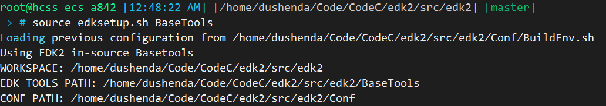

## 背景介绍
编译edk2代码，配置开发环境，服务器使用华为云耀云服务器，OS信息如下


特点
- apt-get源可以访问
- github不能访问
- gitee可以访问

## 远程仓库迁移

因为编译需要clone相关仓库到指定路径，并且为了今后的同步方便，所以把github仓库迁移到gitee后再配置相关环境。配置流程如下
1. 建立组织，用来合并仓库环境
   
   
2. 迁移主仓库
   
   
3. 导入submodule，因为edk2后续编译还需要一些子模块，找到如下仓库的路径，按照2导入到组织
   
   
4. 修改主仓库的submodule路径
   
   

## 下载
下载edk2代码仓
```console
git clone git@gitee.com:edk2_back/edk2.git
```
下载子模块到对应路径，可以看到地址都替换了gitee路径
```console
git submodule update --init
```


## 编译工具链安装

```console
-> # apt-get install build-essential uuid-dev iasl git gcc nasm python3

-> # python3 --version
Python 3.10.12
-> # ln -s /usr/bin/python3.10 /usr/bin/python
```

## 编译
### 基本工具
看一下当前的目录结构，使用`make -C BaseTools`编译基本工具
```console
-> # ls
ArmPkg           CryptoPkg         FatPkg               Maintainers.txt  pip-requirements.txt  SignedCapsulePkg
ArmPlatformPkg   DynamicTablesPkg  FmpDevicePkg         MdeModulePkg     PrmPkg                SourceLevelDebugPkg
ArmVirtPkg       edksetup.bat      IntelFsp2Pkg         MdePkg           ReadMe.rst            StandaloneMmPkg
BaseTools        edksetup.sh       IntelFsp2WrapperPkg  NetworkPkg       RedfishPkg            UefiCpuPkg
Conf             EmbeddedPkg       License-History.txt  OvmfPkg          SecurityPkg           UefiPayloadPkg
CONTRIBUTING.md  EmulatorPkg       License.txt          PcAtChipsetPkg   ShellPkg              UnitTestFrameworkPkg

-> # make -C BaseTools
```
编译基本工具完成


### 编译目标文件
设置环境变量，`path/to/edk/BaseTools`需要换成当前的`BaseTools`所在路径。
```console
-> # export EDK_TOOLS_PATH=`path/to/edk/BaseTools`
-> # ./edksetup.sh --help
Usage: edksetup.sh [Options]

The system environment variable, WORKSPACE, is always set to the current
working directory.

Options:
  --help, -h, -?        Print this help screen and exit.

  --reconfig            Overwrite the WORKSPACE/Conf/*.txt files with the
                        template files from the BaseTools/Conf directory.

Please note: This script must be 'sourced' so the environment can be changed.
. edksetup.sh
source edksetup.sh
-> # source edksetup.sh BaseTools
```

在`edk`目录下使用`build`命令编译
```console
-> # build
```
