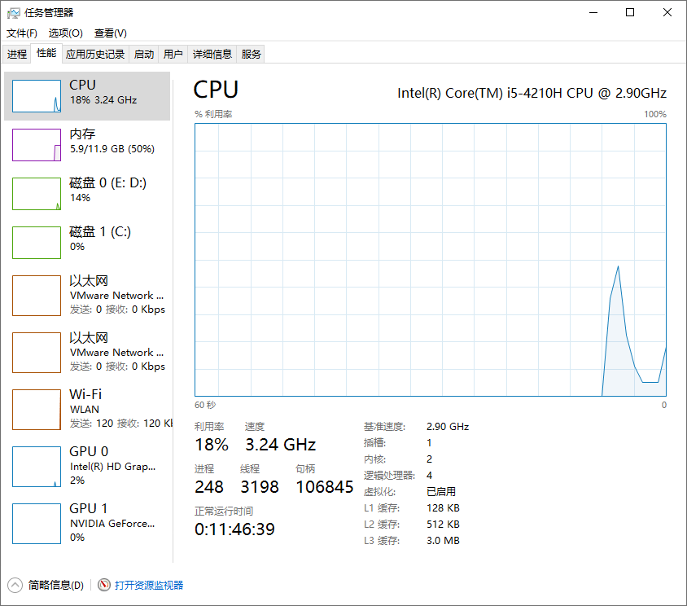
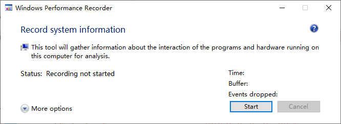
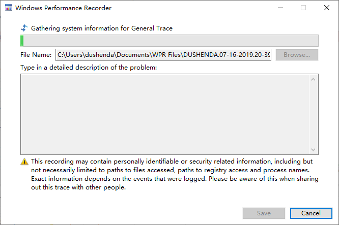
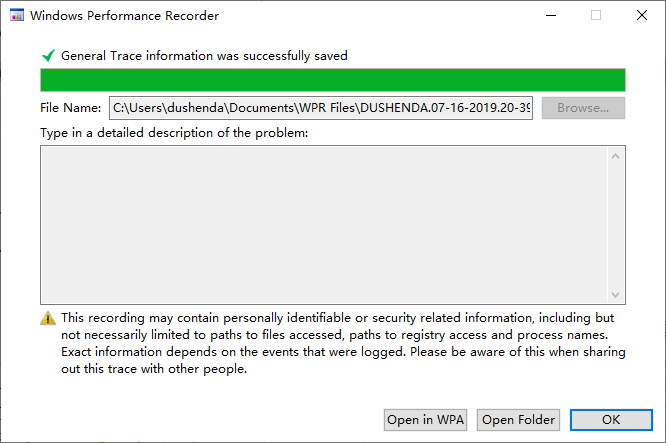
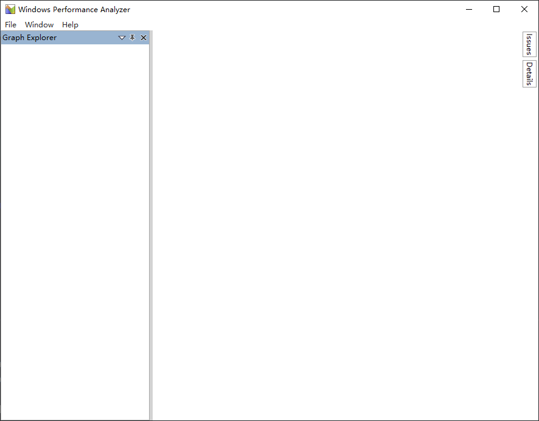
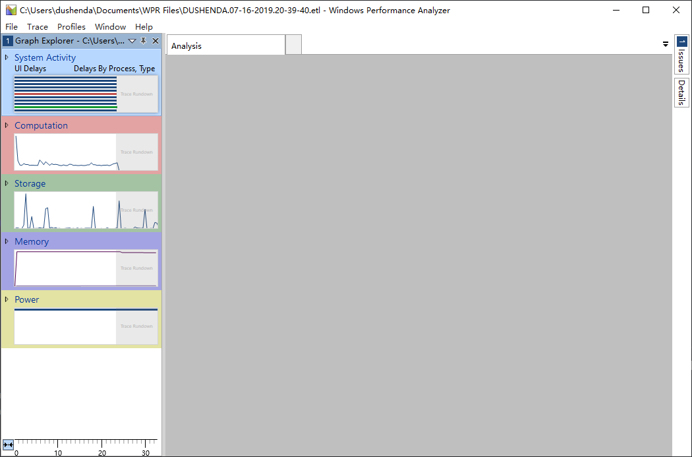
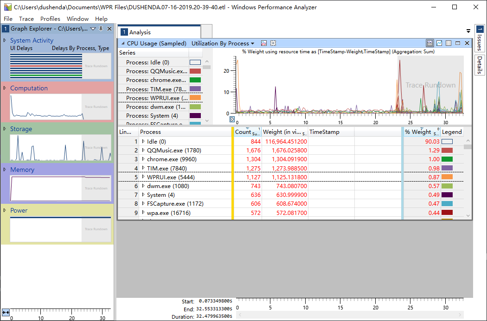
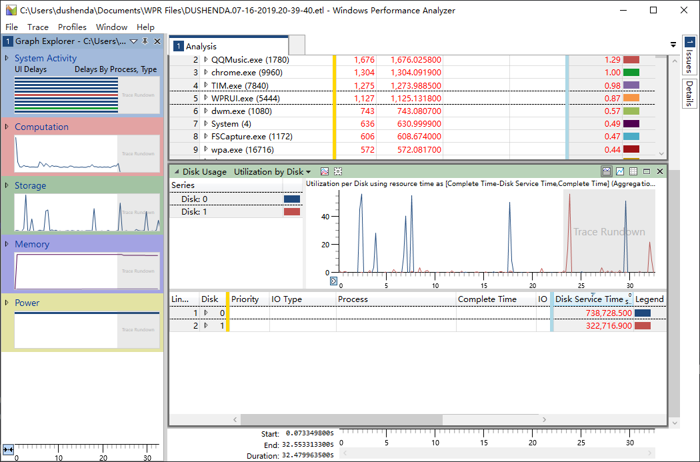

# Windows运行参数分析

这篇文章较为简单，主要是使用 Windows Performance Record 和 Windows Performance Analysis 来分析在运行一段时间内的各个参数的变化，记录详细的信息。

一般大家都是从任务管理器上面来看机器当前的运行状态，但是，如果我想要了解的更详细一些，并且需要一段特定时间的运行参数，任务管理器仿佛就无能为力了，这时候，可以使用 Windows 测试框架里面的两个小工具来记录分析机器的运行状态。

<!--more-->

> Windows Hardware Lab Kit (Windows HLK) 是一个测试框架，用于测试 Windows 10 以及从 Windows Server 2016 开始的所有 Windows Server 版本的硬件设备。 你的产品必须通过使用 Windows HLK 进行的某些测试，才有资格加入 [Windows 硬件兼容性计划](https://docs.microsoft.com/en-us/windows-hardware/design/compatibility/)。
>
> Windows 性能工具包位于 [Windows 评估和部署工具包](https://aka.ms/adk)中，其中包含各种性能监控工具，这些工具可生成有关 Windows 操作系统和应用程序的详细性能概况。 本文档同时讨论了 Windows Performance Recorder (WPR) 和 Windows Performance Analyzer (WPA)。
>
> 包含在[Windows 评估和部署工具包 (Windows ADK)](https://go.microsoft.com/fwlink/p/?LinkId=526740)，Windows 性能记录器 (WPR) 是一种性能录制工具为基础上事件跟踪 Windows (ETW)。 它记录系统事件，然后可以通过使用 Windows Performance Analyzer (WPA) 进行分析。
>
> 包含在[Windows 评估和部署工具包 (Windows ADK)](https://go.microsoft.com/fwlink/p/?LinkId=526740)，Windows Performance Analyzer (WPA) 是一种工具，创建的事件跟踪 Windows (ETW) 事件所记录的 Windows 性能的关系图和数据表记录器 (WPR)、 Xperf 或评估运行评估平台中。 WPA 可以打开任何事件跟踪日志 (ETL) 文件进行分析。

## Windows Performance Record

1. 在程序中搜索到 Windows Performance Record 并且打开，
   

2. 从当前时刻开始记录，记录完成后保存文件
   
   

3. 记下文件保存位置

## Windows Performance Analysis

1. 在程序中找到 Windows Performance Analysis 并且打开
   

2. File->Open，打开前面保存的文件
   
   
   