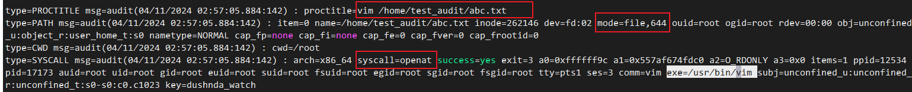
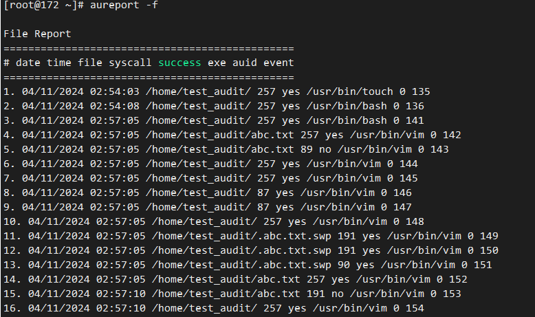

## audit用途
监控文件、命令、网络等，生成监控报告。

## 安装启动audit
安装audit工具
```console
yum install audit
```
配置了 `auditd` 后，启动服务以收集 审计信息，并将它存储在日志文件中。以 root 用户身份运行以下命令来启动 `auditd` ：

```console
service auditd start
```

将 `auditd` 配置为在引导时启动：

```console
systemctl enable auditd
```

可以使用 `# auditctl -e 0` 命令临时禁用 `auditd`，并使用 `# auditctl -e 1` 重新启用它。

可以使用 `service auditd _<action>_` 命令对 `auditd` 执行其他操作，其中 `_<action>_`可以是以下之一：

`stop` ：停止 `auditd`。

`restart`：重新启动 `auditd`。

`reload` 或 `force-reload`：重新加载 `/etc/audit/auditd.conf` 文件中 `auditd` 的配置。

`rotate`：轮转 `/var/log/audit/` 目录中的日志文件。

`resume`：在其之前被暂停后重新恢复审计事件记录，例如，当保存审计日志文件的磁盘分区中没有足够的可用空间时。

`condrestart` 或 `try-restart`：只有当 `auditd` 运行时才重新启动它。

`status`：显示 `auditd` 的运行状态。

## 配置规则

举例说明，监控`/home/test_audit/`文件夹（文件）的变更选项为rwxa（**r**=read, **w**=write, **x**=execute, **a**=attribute），设置关键字`dushnda_watch`
```console
auditctl -w /home/test_audit/ -p rwxa -k dushnda_watch
```
配置完后查询规则
```console
[root@172 ~]# auditctl -l
-w /home/test_audit -p rwxa -k dushnda_watch
```
之后做一些权限改变，增改文件操，查看日志`ausearch`，查看报告`areport`
```console
ausearch -i -k dushnda_watch
```



这里的每个type是一个一次的一条记录，具体的含义查看参考链接`[1]`，这里主要关注对文件的操作，这段日志含义是使用vim打开了文件（syscall），当前文件权限是644。



删除路径监控
```console
auditctl -W /home/test_audit -p rwxa -k dushnda_watch
```
> 其中，auditctl -d的删除和a'u'd

## 参考链接

[1] https://access.redhat.com/documentation/zh-cn/red_hat_enterprise_linux/8/html/security_hardening/auditing-the-system_security-hardening#linux-audit_auditing-the-system

[2] https://deepinout.com/linux-cmd/linux-audit-system-related-cmd/linux-cmd-auditctl.html