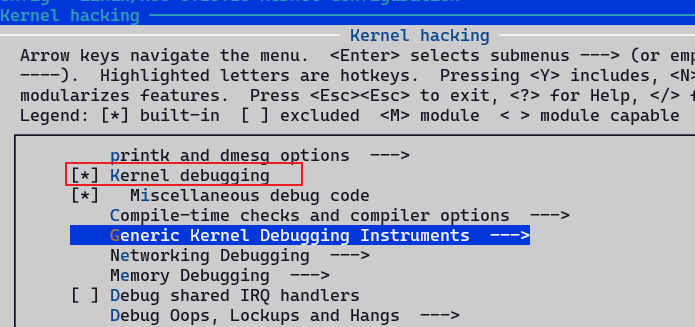
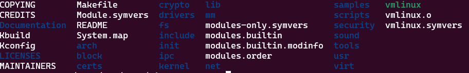
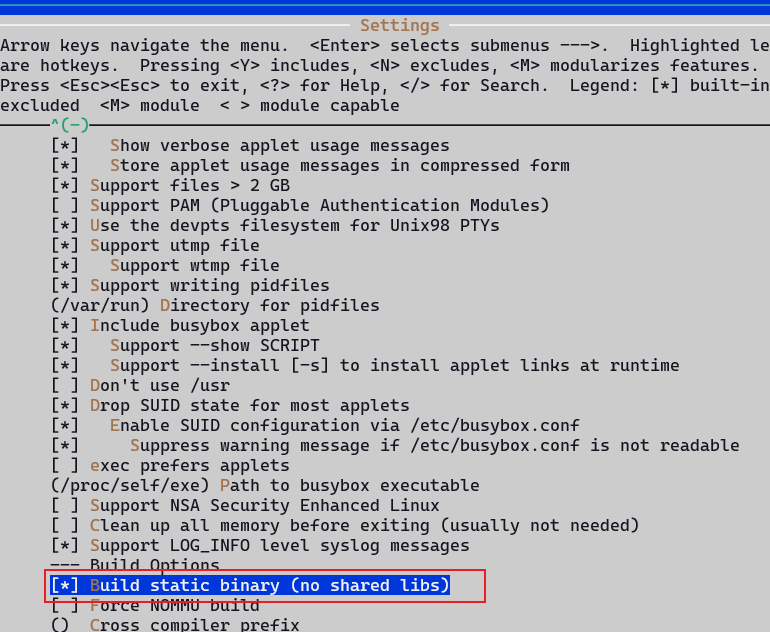
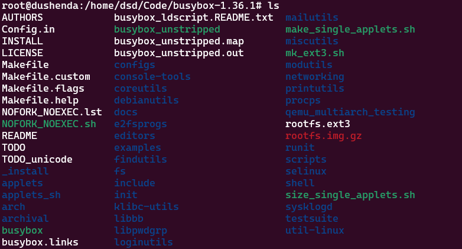
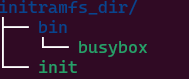
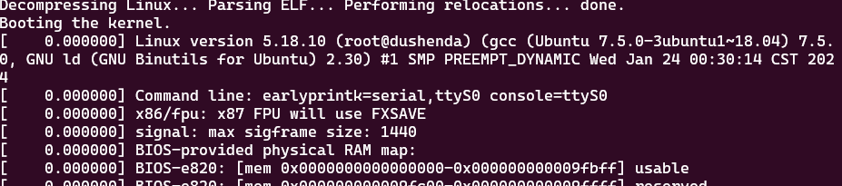
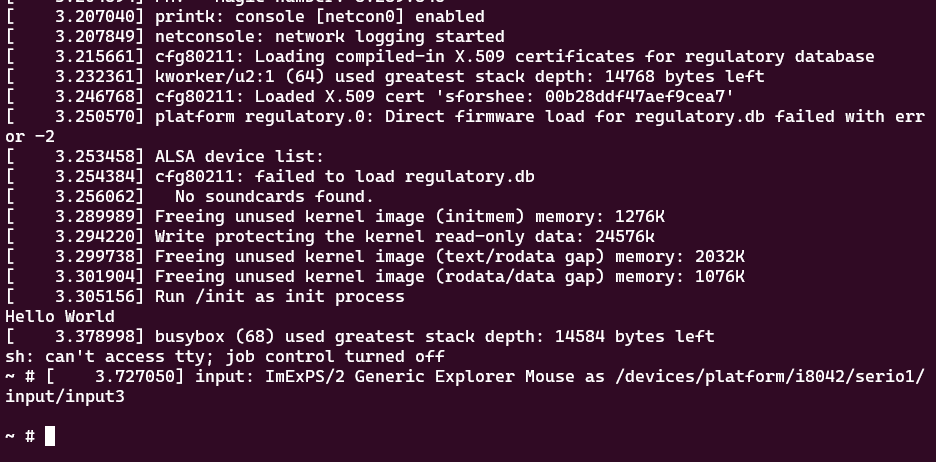

## 编译内核

### 下载
kernel：https://mirrors.edge.kernel.org/pub/linux/kernel/

镜像：https://mirrors.ustc.edu.cn/kernel.org/linux/kernel/

### 编译

```console
root@dushenda:/home/dsd/Code/linux-5.18.10# make menuconfig
root@dushenda:/home/dsd/Code/linux-5.18.10# make -j`nproc`
```

编译完成得到


## 制作initramfs
### 使用busybox

```console
root@dushenda:/home/dsd/Code/busybox-1.36.1# make menuconfig
root@dushenda:/home/dsd/Code/busybox-1.36.1# make -j`nproc`
root@dushenda:/home/dsd/Code/busybox-1.36.1# make install
```

编译完成得到


制作initramfs.img，首先构造如下的目录结构

init文件内容如下：

```consoel
root@dushenda:/home/dsd/Code/initramfs_dir# find . -print0 | cpio -ov --null --format=newc | gzip -9 > ../initramfs.img
```
最后生成文件

qemu运行新内核
```console
root@dushenda:/home/dsd/Code/initramfs_dir# qemu-system-x86_64 \  
											-kernel bzImage \  
											-initrd initramfs.img \  
											-m 1G \  
											-nographic \  
											-append "earlyprintk=serial,ttyS0 console=ttyS0"
```
运行结果如下



## 注意
`init`需要设置为可执行权限

qemu退出快捷键ctrl+a按下后释放，再按x