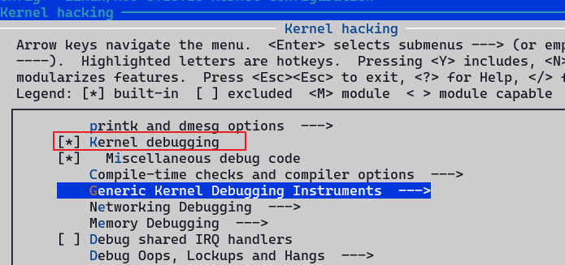
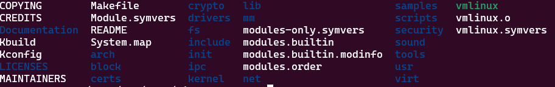
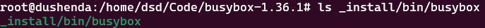
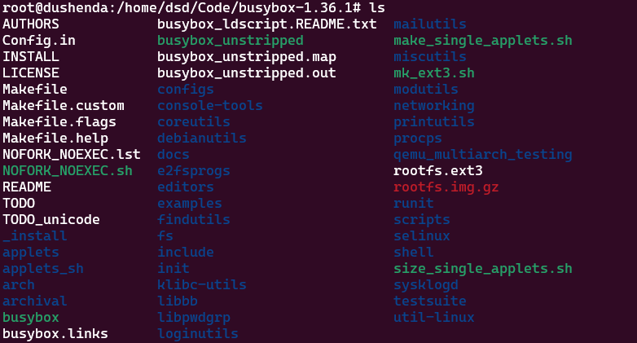

## 编译内核

### 下载
kernel：https://mirrors.edge.kernel.org/pub/linux/kernel/

镜像：https://mirrors.ustc.edu.cn/kernel.org/linux/kernel/

### 编译

```console
root@dushenda:/home/dsd/Code/linux-5.18.10# make menuconfig
root@dushenda:/home/dsd/Code/linux-5.18.10# make -j`nproc`
```

编译完成得到


## 制作initramfs
### 使用busybox

```console
root@dushenda:/home/dsd/Code/busybox-1.36.1# make menuconfig
root@dushenda:/home/dsd/Code/busybox-1.36.1# make -j`nproc`
root@dushenda:/home/dsd/Code/busybox-1.36.1# make install
```

编译完成得到


制作initramfs.img，首先构造如下的目录结构

```consoel
root@dushenda:/home/dsd/Code/initramfs_dir# find . -print0 | cpio -ov --null --format=newc | gzip -9 >   
initramfs.img
```