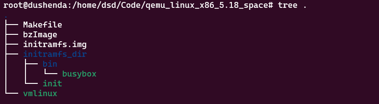

## GDB调试
当前文件夹目录

Makefile文件
```Makefile
cpvmlinux:  
cp /home/dsd/Code/linux-5.18.10/vmlinux vmlinux  
  
cpimage:  
cp /home/dsd/Code/linux-5.18.10/arch/x86/boot/bzImage ./bzImage  
  
initramfs:  
cd ./initramfs_dir && find . -print0 | cpio -ov --null --format=newc | gzip -9 > ../initramfs.img  
  
run:  
qemu-system-x86_64 \  
-kernel bzImage \  
-initrd initramfs.img \  
-m 1G \  
-nographic \  
-append "earlyprintk=serial,ttyS0 console=ttyS0"  
  
  
debug:  
qemu-system-x86_64 \  
-kernel bzImage \  
-initrd initramfs.img \  
-m 1G \  
-nographic \  
-append "earlyprintk=serial,ttyS0 console=ttyS0 nokaslr" \  
-S \  
-gdb tcp::9000
```
此目录下新建`.gdbinit`文件
```console
target remote :9000  
break start_kernel  
continue  
step
```
在