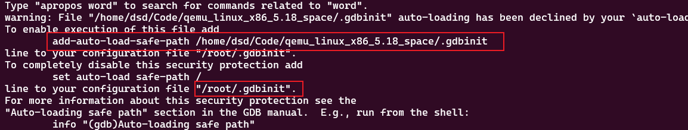
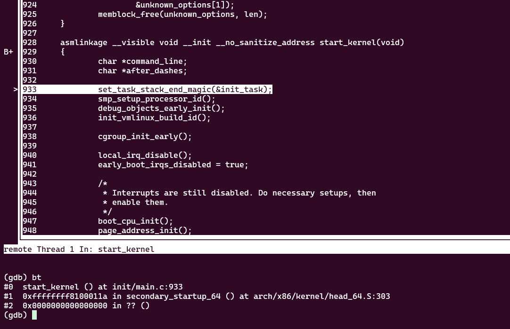
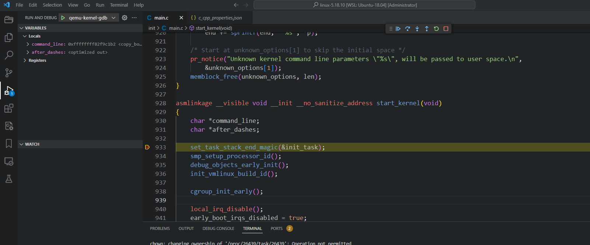

## GDB调试

当前文件夹目录

Makefile文件
```Makefile
cpvmlinux:  
cp /home/dsd/Code/linux-5.18.10/vmlinux vmlinux  
  
cpimage:  
cp /home/dsd/Code/linux-5.18.10/arch/x86/boot/bzImage ./bzImage  
  
initramfs:  
cd ./initramfs_dir && find . -print0 | cpio -ov --null --format=newc | gzip -9 > ../initramfs.img  
  
run:  
qemu-system-x86_64 \  
-kernel bzImage \  
-initrd initramfs.img \  
-m 1G \  
-nographic \  
-append "earlyprintk=serial,ttyS0 console=ttyS0"  
  
  
debug:  
qemu-system-x86_64 \  
-kernel bzImage \  
-initrd initramfs.img \  
-m 1G \  
-nographic \  
-append "earlyprintk=serial,ttyS0 console=ttyS0 nokaslr" \  
-S \  
-gdb tcp::9000
```
此目录下新建`.gdbinit`文件
```console
target remote :9000  
break start_kernel  
continue  
step
```
在`root/.gdbinit`文件增加`add-auto-load-safe-path /home/dsd/Code/qemu_linux_x86_5.18_space/.gdbinit`

运行指令，任选一条
```console
gdb vmlinux
gdb-multiarch vmlinux --tui
```

## vscode调试

wsl权限问题，目录往外多一些
```
chown 755 <usr> *
```
生成编译指令信息，此时linux源码根目录下增加文件`compile_commands.json`
```console
./scripts/clang-tools/gen_compile_commands.py
```
配置`.vscode/lanuch.json`
```json
{
    // Use IntelliSense to learn about possible attributes.
    // Hover to view descriptions of existing attributes.
    // For more information, visit: https://go.microsoft.com/fwlink/?linkid=830387
    "version": "0.2.0",
    "configurations": [
        {
            "name": "qemu-kernel-gdb",
            "type": "cppdbg",
            "request": "launch",
            "miDebuggerServerAddress": "127.0.0.1:9000",
            "program": "${workspaceRoot}/vmlinux",
            "args": [],
            "stopAtEntry": false,
            "cwd": "${fileDirname}",
            "environment": [],
            "externalConsole": false,
            "MIMode": "gdb",
            "setupCommands": [
                {
                    "description": "Enable pretty-printing for gdb",
                    "text": "-enable-pretty-printing",
                    "ignoreFailures": true
                }
            ]
        },
    ]
}
```
配置`.vscode/c_cpp_properties.json`
```json
{
    "configurations": [
        {
            "name": "Linux",
            "includePath": [
                "${workspaceFolder}/**"
            ],
            "defines": [],
            "compilerPath": "/usr/bin/gcc",
            "cStandard": "c11",
            "cppStandard": "gnu++14",
            "intelliSenseMode": "linux-gcc-x64",
            "compileCommands": "${workspaceFolder}/compile_commands.json"
        }
    ],
    "version": 4
}
```
开始调试
