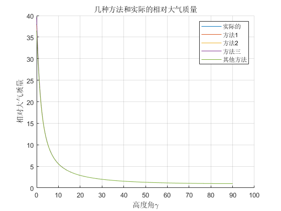
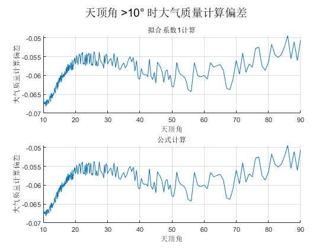

# 三种大气质量和一个公式的计算方法

## 简介

​	整理的文献为 *Revised optical air mass tables and approximation formula* 。

​	文章一开始介绍了一个由 Karsten 在1965年发表的并且广泛被世界所采用的关于大气质量的近似公式，并且讨论了一些由于各个学科对于不同的物理量符号和术语的不同使得读者经常由此而困惑。

​	其后介绍了一个计算大气光学质量的近似公式，然后说明了在公式中存在的一种不定情况，之后又对这个近似公式用非线性最小二乘法进行修正得到了一组新的系数。后面又根据索引文献[1]文中也多次提到这篇文献，很多都是从这篇文献里面来的。

​	还有从一篇《基于遥感与地面监测数据的城市气溶胶定量反演研究》，作者是王耀庭，南京师范大学博士论文。

## 一个通用的计算公式

$$
m(\gamma)=\frac{m_{abs}(\gamma)}{m_{abs}(90^{\circ})}
$$

$$
m_{abs}(\gamma)=\rho_{0}\int^{\infty}_{0} \frac{\rho}{\rho_{0}}([1-[1+2\delta_{0}(1-\frac{\rho}{\rho_{0}})]]\times
	[\frac{\cos \gamma}{1+\frac{h}{R}}]^{2})^{-\frac{1}{2}}dh
$$

$$
h是相对于海平面的平均高度；\\
	\rho=\rho(h)，是在高度h处的大气质量；
$$

​											表1 已知参数


​	根据以上的式子 (1),(2) 和已知的参数表1。要计算这个定积分，那就还需要知道 $ρ$, 也就是 $ρ(h)$ 在高度 h 处的大气密度，但是我在文献中找不到，这是个问题，不知道是不是需要再去别的地方找这个 $ρ$，看完了这篇文章之后，知道了这个 $ρ$ 还是没有找到，但是文章已经给出了计算得到的结果的表格。

## 近似计算公式和不同的系数

$$
f(\gamma)=[\sin \gamma+a(\gamma+b)^{-c}]^{-1}
$$

$$
\gamma是高度角，单位是^\circ;\\
f(\gamma)是用近似公式计算的m(\gamma);\\
a,b,c是式子的常数，a=0.1500，b=3.885^{\circ}，c=1.253;
$$

​	a,b,c这三个常数决定于最小二乘法的相对误差，也就是用前面的计算公式计算数据之后，用最小二乘法进行拟合，使用(3)的形式来计算三个常数。

​	文献后面又介绍了两个不同的参数组合，一个是根据非线性最小二乘法计算的 $a=0.50572,b=6.07995°,$ $c=1.6364$；一个是根据 $Bemporad$ 的经典大气质量表确定的，$a=0.6556,b=6.379°,c=1.757[1]$，其中文献的表中的 $r(γ)$ 是根据公式(4)计算的相对误差，用来衡量计算大气质量的相对误差。
$$
r(\gamma)=\frac{f(\gamma)-m(\gamma)}{m(\gamma)}
$$

## 积分问题和解决

​	对于公式(2)，积分会在 $γ=0$ 和 $h$ 接近于0的地方不定，在这种情况下，这个积分可以通过执行一个特殊的程序来进行计算，在参考文献[1]中有写这个程序。但是在计算的时候有个错误会混入，在地平线上的值 36.2648 会比实际的小 5% 左右。

​	举例而言，在 Link 和 Neuzil[3] 文章的表中所给出的地平线上的在1962年美国的标准大气的大气质量是38.16，这跟 1959 年 Karsen 用的 ARDC 模型十分接近。Snider 和 Goldman[4] 给出的关于 1962 年的模型的38.10也是高度相似。Treve[5] 使用1959年的 ARDC 模型，得到了在地平线上的相对大气质量分别是 $0.55μm $ 的38.11和在 $0.70μm$ 的38.08。

​	还有就是采用一种新的标准来却确定式子 (2) 中的参数会优于旧的模型，也就是最新的国际标准化组织的大气模型 (ISO Standrad Atmophere) 代替 ARDC 模型大气(由国际民航组织 ICAO 提出的)，这个仅有的变化也就是名义地球半径变为 $R=6.356766×10^6m$。

## 一个计算公式

$$
m=\frac{1}{cos \frac{\pi \theta_0}{180^\circ}+0.15\times(93.885-\theta_0)^{-1.253}}
$$

​	其中m是需要计算的大气质量，$\theta_0$ 是天顶角。

## 我要做的工作

​	在这篇文章里面，我要做的就是编写一个程序，根据文献中的大气质量近似公式(3)，并且用不同的参数组带入，将表格中自变量太阳高度角γ作为自变量带入近似公式计算，再与表格中所给的大气质量数进行作差比较，即验证这个算法是否真的符合实际，如果误差较小，则可以用到我们的项目中去。


​	上面的这张表格也就说明了在文章计算的数据中天顶角 $γ$  的取值变化，也就是计算的时候自变量所采用的值。过计算得到了一些结果。

## 结果


​							      图1 标准大气质量和用其他公式计算的大气质量



​									图2 四种计算方法与标准大气质量


​									图3 三种拟合系数计算的大气质量


​											图4 误差曲线

## 分析

​	从上面的图中可以看到，用三种不同的系数计算的相对大气质量以及三组拟合系数的误差曲线，从图中可以看到，三者在天顶角大于 30° 之后都是差不多的经度，主要就是在30°之前的差异。而且可以看到在起始点的时候，第一组和第三组都有很大的误差，特别是第三组，误差都接近于4%，回想文章中提到的积分会在 $γ=0$ 和 h 接近于 0 的地方不定，需要查阅参考文献[1]来寻找解决方法。但是我看到这个计算的第二组拟合系数表现的很好，不知道是否可以用第二组数据来计算，或者是这三组数据都是在不同的情况下表现的经度水平会不一样。但是有个问题，我们没有找到拟合系数1的这条曲线，在下面会进行说明，实际上<u>它是和其他公式计算的这条曲线重合了</u>。

​	对比三种方法和一个计算公式，发现计算公式的误差在几个计算方法折中的位置，在角度 >10° 之后，这个计算值的偏差与第二组拟合系数计算的误差一样，都是非常小的。

​	可以看看在高度角大于10°时候的表现。


​							图 5  在高度角大于10°时候计算大气质量的误差

​	这里没有找到拟合系数1这条曲线，是因为他的变化与公式计算的是一模一样的，两条线是重合的。



​						图 6  拟合系数1和公式计算的天顶角大于10°的误差曲线

​	这说明，其实拟合系数1也就是将天顶角计算的公式做了稍微的变化，就得到了太阳高度角的，<u>本质上，这两个公式是一模一样的</u>，只是取得系数不同罢了。

## 新给的数据的计算

​	在之后使用已经写好的这几种计算方法来计算新的数据值，数据可以在 ‘1.xlsx’ 表格中找到。


​       							图 7  根据所给的数据计算的三天的大气质量数值

​	可以看到，其实一天内的天顶角并不是全是 0~90° 的，这几天维持在 40° 以下，这时候，查阅标准数据也是差不多在这样的数据范围。

## 参考文献

[1] Kasten,"A New Table and Approximation Formula for the Relative Optical Air Mass",Arch.Meteorol.Geophys.Bioklimatol.Ser.B 14,206-223(1965).
[2] R.A Miner,K.S.W.Chamption,and H.L.Pond,The ARDC Model Atmosphere,1959,Air Force Surveys in Geophysics 11(AFCRL,1959)
[3] F.Link and L.Neuzil,Table of Light Trajectories in the Terrestrial Atmosphere(Hermann,Paris,1969)
[4] D.E Snier and A. Goldman,Refractive Effects in Remote Sensing of Atmosphere with Infrared Transmission Spectroscopy,(Ballistic Research Labratories,June 1975)
[5] Y. M. Treve, New Values of the Optical Air Mass and the
Refraction and Comparison with Previous Tables," in Proceed-ings, Second Tropospheric Refraction Effects Technical ReviewMeeting, Technical Documentary Rep. ESD-TDR 64-103, May1964 (National Technical Information Service Order AD-442626), pp.5-391.
[6] International Organization for Standardization,Standard Atmosphere,International Standard ISO253(1972)
[7] S.L.Valley,Handbook of Geophysics and Space Physics
(AFCRL,1965), pp.23.
[8] W.H.Jefferys,M.J.Fitzpatrick,B.E.McArthur,andJ.E.
McCartney, GaussFit:A System for Least Squares and RobustEstimation (U. Texas at Austin, 1989).
[9] A.T.Young,Observational Technique and Data Reduction," inle to Methods of Experimental Physics(Vol. 12, Astrophysics; Partrmly A:Optical and Infrared),N,Carleton,Ed.(Academic, New York, 1974),p.150.

## 代码

```MATLAB
% 主函数
clear;clc;
%x的步长选取
x1=0:0.1:20;
x2=20.2:0.2:30;
x3=30.5:0.5:55;
x4=56:1:90;
x=[x1,x2,x3,x4];
%定义Latxe字符
gamma=texlabel('gamma');flambda=texlabel('f(lambda)');
txt = texlabel('f(lambda)=[sin gamma+a(gamma+b)^{-c}]^{-1}');
%输入标准数据，画标准数据图像
data=xlsread('datain.xlsx');
datax=data(:,1);px=datax;
datay=data(:,2);py=datay;
subplot(2,1,1)
plot(datax,datay);grid on;box off;
xlabel(['高度角',gamma]);ylabel({'标准的相对大气质量';flambda});
% print('Standard','-deps');
%调用三个计算函数
airMass1=massCal1(x);
airMass2=massCal2(x);
airMass3=massCal3(x);
airMass4=massCal4(x);
subplot(2,1,2)
plot(datax,airMass4);
xlabel(['高度角',gamma]);ylabel({'其他公式计算的相对大气质量';flambda});
suptitle('相对大气质量与高度角的关系');grid on;box off

figure(2);
set(figure(2),'PaperSize',[42,60]);
suptitle(['\fontsize{14}',txt]);
subplot(3,1,1)
plot(x,airMass1);grid on;box off;
text(60,30,'a=0.1500,b=3.885,c=1.253');
xlabel(['高度角',gamma]);ylabel({'计算的相对大气质量';flambda});
subplot(3,1,2)
plot(x,airMass2);grid on;box off;
text(60,30,'a=0.50572,b=6.07995,c=1.6364');
xlabel(['高度角',gamma]);ylabel({'计算的相对大气质量';flambda});
subplot(3,1,3)
plot(x,airMass3);grid on;box off;
text(60,30,'a=0.6556,b=6.379,c=1.757');
xlabel(['高度角',gamma]);ylabel({'计算的相对大气质量';flambda});
set(gcf, 'position', [1920/4 1080/4 1920/2 1080/1.5]);
% print('Calculate','-deps');
%画三个函数的误差曲线
datay=datay';
delta1 = (airMass1-datay)./datay*100;
delta2 = (airMass2-datay)./datay*100;
delta3 = (airMass3-datay)./datay*100;
delta4 = (airMass4-datay)./datay*100;
figure(3)
plot(x,delta1);grid on;box off;hold on
plot(x,delta2,'--');grid on;box off;hold on
plot(x,delta3,':');grid on;box off;hold on
plot(x,delta4);grid on;box off;
xlabel(['高度角',gamma]);ylabel('三种大气质量的误差(%)');
legend('第1组拟合系数','第2组拟合系数','第3组拟合系数','其他公式计算');
title('几种计算方法的误差');
% print('Error','-deps');
figure(4)
plot(datax,datay);grid on;box off;hold on
plot(x,airMass1);grid on;box off;hold on
plot(x,airMass2);grid on;box off;hold on
plot(x,airMass3);grid on;box off;hold on
plot(x,airMass4);grid on;box off;
xlabel(['高度角',gamma]);ylabel('相对大气质量');
legend('实际的','方法1','方法2','方法三','其他方法');
title('几种方法和实际的相对大气质量');

[~,Date,~] = xlsread('1.xlsx','A2:A105');
Date = datetime(Date,'InputFormat','dd/MM/yyyy');
Date.Format = 'yyyy-MM-dd';
Time = days(xlsread('1.xlsx','B2:B105'));
Time.Format = 'hh:mm:ss';
datetime = Date+Time;
datetime.Format = 'yyyy-MM-dd hh:mm:ss';
xxx=xlsread('1.xlsx','C2:C105');
xx=90-xxx;
airMassx1=massCal1(xx);
airMassx2=massCal2(xx);
airMassx3=massCal3(xx);
airMassx4=massCal4(xx);
output=[airMassx1,airMassx2,airMassx3,airMassx4];
xlswrite('output.xlsx',output);

figure
datetime = datenum(datetime);
plot(datetime,airMassx1);grid on;box off;hold on
plot(datetime,airMassx2);grid on;box off;hold on
plot(datetime,airMassx3);grid on;box off;hold on
plot(datetime,airMassx4);grid on;box off;hold on
dateFormat = 'yy-mm-dd HH:MM:SS';
datetick('x',dateFormat)
%plot(px,py);grid on;box off;
legend('计算方法1','计算方法2','计算方法3','其他方法计算的');
xlabel('时间');ylabel('大气质量');
title('新给的数据的高度角计算的值')

p = (x>10);
x = x(p);
delta1 = delta1(p);
delta2 = delta2(p);
delta3 = delta3(p);
delta4 = delta4(p);
figure
plot(x,delta1);hold on
plot(x,delta2);hold on
plot(x,delta3);hold on
plot(x,delta4);grid on;box off;
xlabel('高度角');ylabel('大气质量计算偏差');
title('高度角 >10° 时大气质量计算偏差');
legend('拟合系数1','拟合系数2','拟合系数3','公式计算');

figure
subplot(2,1,1)
plot(x,delta1);box off;grid on
xlabel('高度角');ylabel('大气质量计算偏差');
title('拟合系数1计算');
subplot(2,1,2)
plot(x,delta4);box off;grid on
xlabel('高度角');ylabel('大气质量计算偏差');
title('公式计算');
suptitle('高度角 >10° 时大气质量计算偏差')
```

```matlab
% 计算方法1
function y=massCal1(gamma)
%函数调用格式：airMass=massCal1(gamma)
%输入参数说明：gamma是天顶角，单位是°
%输出参数说明：airMass是大气质量
a=0.1500;b=3.885;c=1.253;
% gamma=gamma*pi/180;%b=b*pi/180;
y=(sin(gamma*pi/180)+a*(gamma+b).^(-c)).^(-1);
end
```

```matlab
% 计算方法2
function y=massCal2(gamma)
%函数调用格式：airMass=massCal2(gamma)
%输入参数说明：gamma是天顶角，单位是°
%输出参数说明：airMass是大气质量
a=0.50572;b=6.07995;c=1.6364;
y=(sin(gamma*pi/180)+a*(gamma+b).^(-c)).^(-1);
end
```

```matlab
% 计算方法3
function y=massCal3(gamma)
%函数调用格式：airMass=massCal(gamma)
%输入参数说明：gamma是天顶角，单位是°
%输出参数说明：airMass是大气质量
a=0.6556;b=6.379;c=1.757;
y=(sin(gamma*pi/180)+a*(gamma+b).^(-c)).^(-1);
end
```

