# 几种算法误差报告

​	本文主要探讨了几种计算天顶角的算法，并且根据已经测得的标准数据进行了误差对比，以此来判断几种算法的精度。

## 原算法的误差

### 算法的计算步骤

​	算法的详情我不是很了解，但是我得到了计算后的数据，将其与标准数据做对比。

### 算法的实现代码

​	MATLAB代码，new1是通过.csv文件导入得到的.mat数据。

```matlab
%连接日期与时间
new1.Date.Format = 'dd.MM.uuuu HH:mm';
new1.Time.Format = 'dd.MM.uuuu HH:mm';
x = new1.Date + timeofday(new1.Time);
%计算误差
y = new1.Real-new1.Calculate;
%制图
plot(x,y);
xlabel('时间');ylabel('误差');
title('天顶角实际值与计算值的误差');
box off
grid on
```

### 算法的最终结果

​	得到的结果如图:

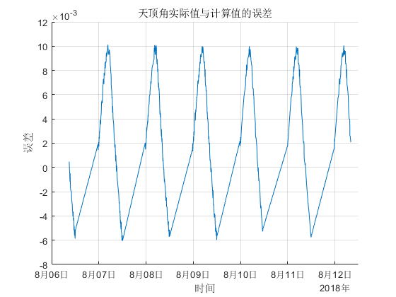

​	根据上图可以看出来，在所给的测试数据中，天顶角的计算误差在**<u>-0.006~0.01</u>**。

## 五种算法的公共部分

### 前时间处理部分

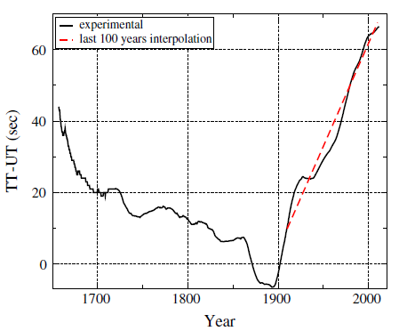

​	Δτ的计算是根据上图用插值法计算的一个线性表达式
$$
\Delta\tau=96.4+0.00158t\\
t=\Delta day=(year_{now}-2060)\times365.2425
$$
​	参数解释:

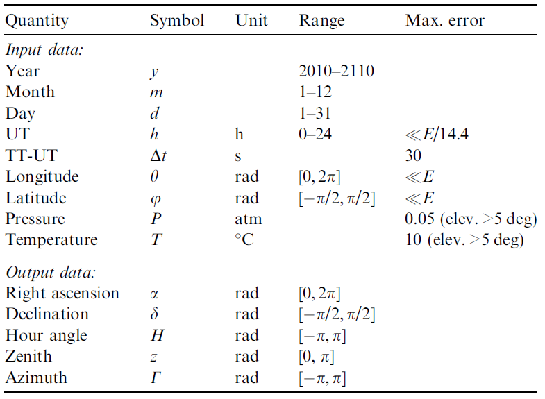

​	根据实际情况，确定了一些参数

| 参数名称 | 参数符号 | 单位 |      参数值       |
| :------: | :------: | :--: | :---------------: |
|   经度   |    θ     | rad  | 1.647765346807846 |
|   纬度   |    φ     | rad  | 0.699702497124527 |
|   压强   |    P     | atm  |    0.85862324     |
|   温度   |    T     |  ℃   |        25         |

​	在计算过程中，如果月份m<2，那么把月份加12，年份减1，这里的INT是表示向0取整。前处理过程如下：

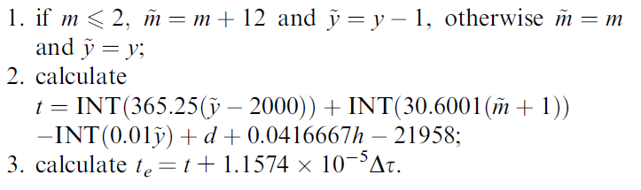
$$
\omega=0.017202786day^{-1}
$$

### 后角度计算部分

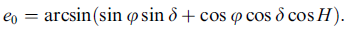

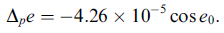

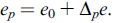

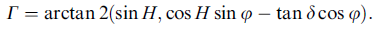

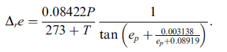

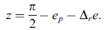

​	计算时只需要知道经**纬度，赤经赤纬，时角**就可以了。

## 第一种算法的误差

### 算法的计算步骤

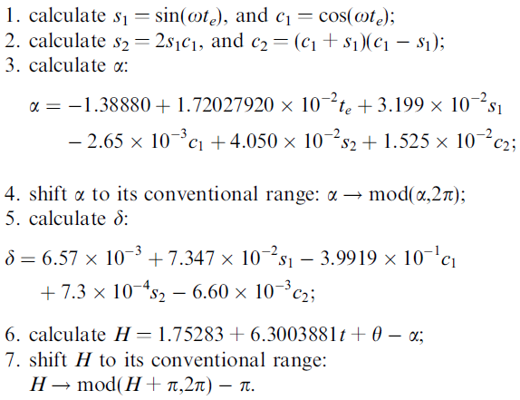

### 算法的实现代码

```matlab
% 主函数
% 第一种算法的计算误差
clear;clc;
% 合并日期，提取信息
load('table.mat', 'new1');
new1.Date.Format = 'dd.MM.uuuu HH:mm';
new1.Time.Format = 'dd.MM.uuuu HH:mm';
x = new1.Date + timeofday(new1.Time);
[y,m,d,h,min,sec] = readDateTime(x);
%调用算法函数计算
data = [y,m,d,h,min,sec];
[GammaAngle,zAngle] = reportFun1(data);
Real = new1.Real;
% 计算差值
y = Real-zAngle';
% 画图
plot(x,y);
xlabel('时间');ylabel('误差');
title('天顶角实际值与计算值的误差');
box off
grid on
```

```matlab
% reportFun1函数
% 主要是根据文献的步骤写的
function [GammaAngle,zAngle] = reportFun1(data)
[y,m,d,h,min,sec,lon,lat,pre,tem] = readFile(data);
%需要转化为的数值或者其他常量
[theta,phi,omega,t,te]=Preprocess(y,m,d,h,min,sec,lon,lat);
%算法第一步，计算s1=sin(omega*te),c1=cos(omega*te);
s1 = sin(omega*te);c1=cos(omega*te);
%算法第二步，计算s2=2*s1*c1,c2=(c1+s1)*(c1-s1)
s2=2*s1.*c1;c2=(c1+s1).*(c1-s1);
%算法第三步，计算赤经α
alpha = -1.38880+1.72027920*10^(-2)*te+3.199*10^(-2)*s1...
        -2.65*10^(-3)*c1+4.050*10^(-2)*s2+1.525*10^(-2)*c2;
%算法第四步，把α转换到方便的范围:α→mod(α,2π)
alpha = mod(alpha,2*pi);                                 %根据算法用方便的范围代替，此时还是弧度
alphaAngle = alpha*180/pi;                                %转换到角度
%算法第五步，计算赤纬δ
delta = 6.57*10^(-3)+7.347*10^(-2)*s1-3.9919*10^(-1)*c1...
        +7.3*10^(-4)*s2-6.60*10^(-3)*c2;
deltaAngle = delta*180/pi;
%算法第六步，注意都要用弧度                              
H = 1.75283+6.3003881*t+theta-alpha;
%算法第七步,转到方便的范围H→mod(H+π，2π)-π
H = mod(H+pi,2*pi)-pi;
HAngle = H*180/pi;                                        %转角度输出
% %Final Step,几个算法都一样的
[GammaAngle,zAngle]=finalStep(phi,delta,H,tem,pre);
end
```

```matlab
% ReadFile函数
% 读取年月日时分秒
function [y,m,d,h,min,sec,lon,lat,pre,tem] = readFile(data)
y = data(:,1);
m = data(:,2);
d = data(:,3);
h = data(:,4);
min = data(:,5);
sec = data(:,6);
[~,col] = size(data);
if(col>6)
lon = data(:,7);
lat = data(:,8);
pre = data(:,9);
tem = data(:,10);
else
    [lon,lat,pre,tem] = definePara();
end
y=y';
m=m';
d=d';
h=h';
min=min';
sec=sec';
lon=lon';
pre=pre';
tem=tem';
end
```

```matlab
% Preprocess函数
% 主要做一些前处理工作，如计算年积日等，也是根据文献来的
function [theta,phi,omega,t,te]=Preprocess(y,m,d,h,min,sec,lon,lat)
%调用格式[theta,phi,omega,t,te]=Proprocess(y,m,d,h,min,sec,lon,lat)
%输出参数[经度弧度θ，纬度弧度φ，ω常数，与2060相距天数t，t加上Δτ后的te]
%输入参数(年year，月month，日day，时hour，分minute，秒second，经度longitude(°)，纬度latitude(°))
h = h+min/60+sec/3600;              %精确时间
theta = lon*pi/180;                 %theta表示经度的弧度
phi = lat*pi/180;                   %phi表示纬度的弧度
omega = 0.017202786;                %omega是算法给的，单位是day^(-1)
tau = 96.4+0.00158*(y-2060)*365;    %tau是前面用插值曲线计算的，代表论文中的Δτ
if(m<=2)                            %根据前面的描述，如果月份小于2，那么月份+2，年份-1
    m=m+12;
    y=y-1;
end
%根据算法1中的公式计算
%根据论文，也通过验证，代码没问题，下式的t是距离2060的天数，小的为-，大的为+
t = fix(365.25*(y-2000))+fix(30.6001*(m+1))-fix(0.01*y)+d+h/24-21958;
%te就是基于TT独立于地球转动，下面都用这个te来建立全局太阳位置
te = t+1.574*10^(-5)*tau;
end
```

```matlab
% finalStep函数
% 几个算法的最终的步骤都是一样的
function [GammaAngle,zAngle]=finalStep(phi,delta,H,tem,pre)
%函数调用格式:[GammaAngle,zAngle]=FinalStep(phi,delta,H,tem,pre)
%输出参数[方位角GammaAngle(°),天顶角zAngle(°)]
%输入参数(纬度phi,赤纬delta,时角H,温度tem,压强pre)
e0 = asin(sin(phi).*sin(delta)+cos(phi).*cos(delta).*cos(H));      %计算升角e0=arcsin(sinφsinδ+cosφcosδcosH),计算都要弧度
%计算Δpe应该是修正量
deltape = -4.26*10^(-5)*cos(e0);                               %以地心为中心
ep = e0+deltape;
%计算方位角Γ=atan2(...)见下
Gamma = atan2(sin(H),cos(H).*sin(phi)-tan(delta).*cos(phi));
GammaAngle = Gamma*180/pi;
deltare = 0.08422*pre./((273+tem).*tan(ep+(0.003138./(ep+0.08919))));
%计算天顶角z
z = pi/2-ep-deltare;
zAngle = z*180/pi;
end
```

### 算法的最终结果

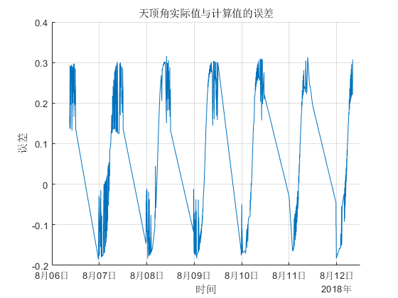

​	根据文献的第一种算法计算的误差不容乐观，在**<u>-0.2~0.3</u>**之间，参考黄冬师兄算的误差，这个扩大了30倍。说明这个算法的精度不是很高，在文献中，这个算法最后也使用了计算数据进行了比较，他给出天顶角的误差范围在**<u>-0.19~0.19</u>**，实际计算的比这个范围稍大些，只能说是我们这个数据不够精确或者文献的数据凑得比较好。

## 第二种算法的误差

### 算法的计算步骤

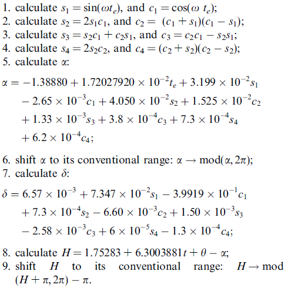

### 算法的实现代码

```matlab
% 主函数
% 第二种算法的计算误差
clear;clc;
% 合并日期，提取信息
load('table.mat', 'new1');
new1.Date.Format = 'dd.MM.uuuu HH:mm';
new1.Time.Format = 'dd.MM.uuuu HH:mm';
x = new1.Date + timeofday(new1.Time);
[y,m,d,h,min,sec] = readDateTime(x);
data = [y,m,d,h,min,sec];
[GammaAngle,zAngle] = reportFun2(data);
Real = new1.Real;
y = Real-zAngle';
plot(x,y);
xlabel('时间');ylabel('误差');
title('天顶角实际值与计算值的误差');
box off
grid on
```

```matlab
% reportFun2函数
function [GammaAngle,zAngle] = reportFun2(data)
[y,m,d,h,min,sec,lon,lat,pre,tem]=readFile(data);
[theta,phi,omega,t,te]=Preprocess(y,m,d,h,min,sec,lon,lat);
[~,col]=size(te);
%Step1
s1=sin(omega*te);c1=cos(omega*te);
%Step2
s2=2*s1.*c1;c2=(c1+s1).*(c1-s1);
%Step3
s3=s2.*c1+c2.*s1;c3=c2.*c1-s2.*s1;
%Step4
s4=2*s2.*c2;c4=(c2+s2).*(c2-s2);
%Step5
alpha = -1.38880*ones(1,col)+1.72027920*10^(-2)*te+3.199*10^(-2)*s1...
        -2.65*10^(-3)*c1+4.050*10^(-2)*s2+1.525*10^(-2)*c2...
        +1.33*10^(-3)*s3+3.8*10^(-4)*c3+7.3*10^(-4)*s4+6.2*10^(-4)*c4;
%Step6
alpha = mod(alpha,2*pi);
%Step7
delta = 6.57*10^(-3)*ones(1,col)+7.347*10^(-2)*s1-3.9919*10^(-1)*c1...
        +7.3*10^(-4)*s2-6.60*10^(-3)*c2+1.50*10^(-3)*s3...
        -2.58*10^(-3)*c3+6*10^(-5)*s4-1.3*10^(-4)*c4;
%Step8
H = 1.75283*ones(1,col)+6.3003881*t+theta-alpha;
H = mod(H+pi*ones(1,col),2*pi)-pi*ones(1,col);
alphaAngle = alpha*180/pi;
deltaAngle = delta*180/pi;
HAngle = H*180/pi;
[GammaAngle,zAngle]=finalStep(phi,delta,H,tem,pre);
end
```

​	其实最大的不同只是reportFun()函数是不一样的，因为这个是算法的核心，主函数也是类似的，写入数据，调用函数，得到输出，最后画一下误差图。

​	其他的前处理函数，后处理函数都是一模一样的。

### 算法的最终结果

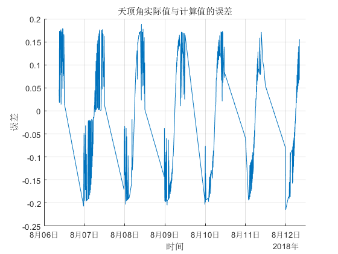

​	根据文献的第二种算法计算的误差也是不太OK，而且有个严重的问题。从图上看出来，这个集散的误差范围在**<u>-0.2~0.2</u>**之间，参考黄冬师兄算的误差，这个误差其实相对于第一种算法减小的不是很多。而且对比文献，他给出天顶角的误差范围在**<u>-0.034~0.034</u>**，实际计算的比这个范围大了6倍，这个误差还是很大的。

## 第三种算法的误差

### 算法的计算步骤

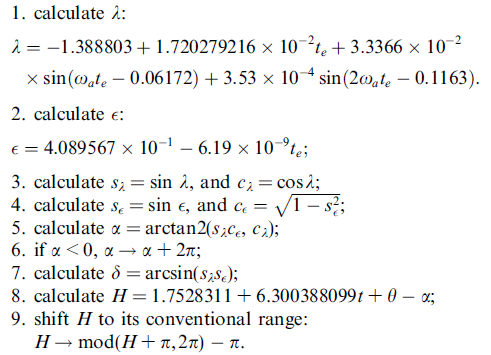

### 算法的实现代码

```matlab
% 主函数
% 第三种算法的计算误差
clear;clc;
% 合并日期，提取信息
load('table.mat', 'new1');
new1.Date.Format = 'dd.MM.uuuu HH:mm';
new1.Time.Format = 'dd.MM.uuuu HH:mm';
x = new1.Date + timeofday(new1.Time);
[y,m,d,h,min,sec] = readDateTime(x);
data = [y,m,d,h,min,sec];
[GammaAngle,zAngle] = reportFun3(data);
Real = new1.Real;
y = Real-zAngle';
plot(x,y);
xlabel('时间');ylabel('误差');
title('天顶角实际值与计算值的误差');
box off
grid on
```

```matlab
function [GammaAngle,zAngle] = reportFun3(data)
[y,m,d,h,min,sec,lon,lat,pre,tem]=readFile(data);
%需要转化为的数值或者其他常量
[theta,phi,~,t,te]=Preprocess(y,m,d,h,min,sec,lon,lat);
[~,col]=size(te);
omegaa = 0.0172019715;
%Step1
lambda = -1.388803*ones(1,col)+1.720279216*10^(-2)*te+3.3366*10^(-2)...
         *sin(omegaa*te-0.06172)+3.53*10^(-4)*sin(2*omegaa*te-0.1163);
%Step2
epsilon = 4.089567*10^(-1)*ones(1,col)-6.19*10^(-9)*te;
%Step3
slambda=sin(lambda);clambda=cos(lambda);
%Step4
sepsilon=sin(epsilon);cepsilon=sqrt(1-sepsilon.^(2));
%Step5
alpha = atan2(slambda.*cepsilon,clambda);
%Step6
if(alpha<0)
    alpha = alpha+2*pi;
end
%Step7
delta = asin(slambda.*sepsilon);
%Step8
H = 1.75283*ones(1,col)+6.3003881*t+theta-alpha;
H = mod(H+pi*ones(1,col),2*pi)-pi*ones(1,col);
alphaAngle = alpha*180/pi;
deltaAngle = delta*180/pi;
HAngle = H*180/pi;
[GammaAngle,zAngle]=finalStep(phi,delta,H,tem,pre);
end
```

### 算法的最终结果

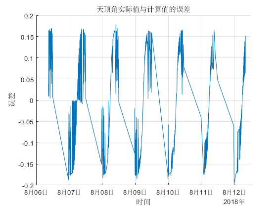

​	从图上看出来，这个计算的误差范围在**<u>-0.17~0.17</u>**之间。对比文献，他给出天顶角的误差范围在**<u>-0.0093~0.0093</u>**，实际计算的比这个范围大了18倍，说明这个差距还是很大的，是有一定问题的。

## 第四种算法的误差

### 算法的计算步骤

.png)

.png)

### 算法的实现代码

```matlab
% 主函数
% 第三种算法的计算误差
clear;clc;
% 合并日期，提取信息
load('table.mat', 'new1');
new1.Date.Format = 'dd.MM.uuuu HH:mm';
new1.Time.Format = 'dd.MM.uuuu HH:mm';
x = new1.Date + timeofday(new1.Time);
[y,m,d,h,min,sec] = readDateTime(x);
data = [y,m,d,h,min,sec];
[GammaAngle,zAngle] = reportFun4(data);
Real = new1.Real;
y = Real-zAngle';
plot(x,y);
xlabel('时间');ylabel('误差');
title('天顶角实际值与计算值的误差');
box off
grid on
```

```matlab
function [GammaAngle,zAngle] = reportFun4(data)
[y,m,d,h,min,sec,lon,lat,pre,tem]=readFile(data);
[theta,phi,~,t,te]=Preprocess(y,m,d,h,min,sec,lon,lat);
[~,col]=size(te);
omegaa = 0.0172019715;
omegan = 9.282*10^(-4);
%Step1
L = 1.752790*ones(1,col)+1.720279216*10^(-2)*te+3.3366*10^(-2)...
    *sin(omegaa*te-0.06172)+3.53*10^(-4)*sin(2*omegaa*te-0.1163);
%Step2
nu = omegan*te-0.8;
%Step3
deltalambda = 8.34*10^(-5)*sin(nu);
%Step4
lambda = L.*ones(1,col)+pi*ones(1,col)+deltalambda;
%Step5
epsilon = 4.089567*10^(-1)*ones(1,col)-6.19*10^(-9)*te+4.46*10^(-5)*cos(nu);
%Step6
slambda=sin(lambda);clambda=cos(lambda);
%Step7
sepsilon=sin(epsilon);cepsilon=cos(epsilon);
%Step8
alpha = atan2(slambda.*cepsilon,clambda);
%Step9
if(alpha<0)
    alpha = alpha+2*pi;
end
%Step10
delta = asin(slambda.*sepsilon);
%Step11
H = 1.7528311*ones(1,col)+6.300388099*t+theta-alpha+0.92*deltalambda;
H = mod(H+pi*ones(1,col),2*pi)-pi*ones(1,col);
alphaAngle = alpha*180/pi;
deltaAngle = delta*180/pi;
HAngle = H*180/pi;
[GammaAngle,zAngle]=finalStep(phi,delta,H,tem,pre);
end
```

### 算法的最终结果

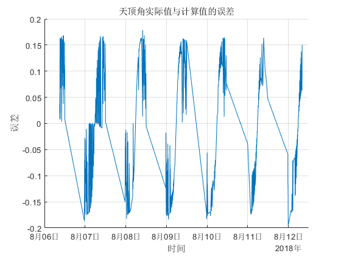

​	算法计算的误差在**<u>-0.17~0.17</u>**之间。与算法三计算的差不多，文献中写的误差范围是**<u>-0.0091~0.0091</u>**，差了17.5倍左右。

## 第五种算法的误差

### 算法的计算步骤

使用算法5计算的时候需要给表格中的参数。

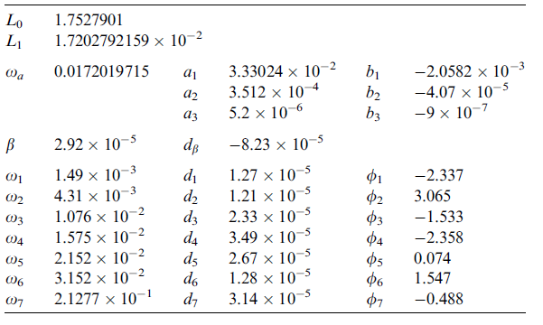

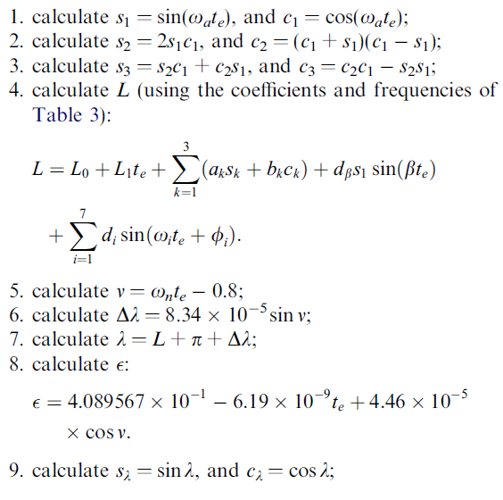

.png)

### 算法的实现代码

```matlab
% 主函数
% 第三种算法的计算误差
clear;clc;
% 合并日期，提取信息
load('table.mat', 'new1');
new1.Date.Format = 'dd.MM.uuuu HH:mm';
new1.Time.Format = 'dd.MM.uuuu HH:mm';
x = new1.Date + timeofday(new1.Time);
[y,m,d,h,min,sec] = readDateTime(x);
data = [y,m,d,h,min,sec];
[GammaAngle,zAngle] = reportFun4(data);
Real = new1.Real;
y = Real-zAngle';
plot(x,y);
xlabel('时间');ylabel('误差');
title('天顶角实际值与计算值的误差');
box off
grid on
```

```matlab
% reportFun5函数
function [GammaAngle,zAngle] = reportFun5(data)
[y,m,d,h,min,sec,lon,lat,pre,tem]=readFile(data);
%需要转化为的数值或者其他常量
[theta,phi,~,t,te]=Preprocess(y,m,d,h,min,sec,lon,lat);
%确定常数
L0 = 1.7527901;
L1 = 1.7202792159*10^(-2);
omegaa = 0.0172019715;
beta = 2.92*10^(-5);
omegan = 9.282*10^(-4);
omega = [1.49*10^(-3),4.31*10^(-3),1.076*10^(-2),1.575*10^(-2),...
         2.152*10^(-2),3.152*10^(-2),2.1277*10^(-1)];
a = [3.33024*10^(-2),3.512*10^(-4),5.2*10^(-6)];
dbeta = -8.23*10^(-5);
d = [1.27,1.21,2.33,3.49,2.67,1.28,3.14]*10^(-5);
b = [-2.0582*10^(-3),-4.07*10^(-5),-9*10^(-7)];
Phi = [-2.337,3.065,-1.533,-2.358,0.074,1.547,-0.488];
     
[~,volume]=size(te);
s1=sin(omegaa*te);c1=cos(omegaa*te);
s2=2*s1.*c1;c2=(c1+s1).*(c1-s1);
s3=s2.*c1+c2.*s1;c3=c2.*c1-s2.*s1;
Sigma7=0;
for i=1:7
    Sigma7=Sigma7+d(i)*sin(omega(i)*te+Phi(i)*ones(1,volume));
end
L=L0*ones(1,volume)+L1*te+(a(1)*s1+a(2)*s2+a(3)*s3+b(1)*c1+b(2)*c2+b(3)*c3)...
    +dbeta*s1.*sin(beta*te)+Sigma7;
nu=omegan*te-0.8;
deltalambda=8.34*10^(-5)*sin(nu);
lambda=L+pi*ones(1,volume)+deltalambda;
slambda=sin(lambda);clambda=cos(lambda);
epsilon = 4.089567*10^(-1)*ones(1,volume)-6.19*10^(-9)*te+4.46*10^(-5)*cos(nu);
sepsilon=sin(epsilon);cepsilon=sqrt(1-sepsilon.^(2));
alpha=atan2(slambda.*cepsilon,clambda);
for i=1:volume
if alpha(i)<0
    alpha(i)=alpha(i)+2*pi;
end
end
delta=asin(slambda.*sepsilon);
H = 1.7528311*ones(1,volume,1)+6.300388099*t+theta-alpha+0.92*deltalambda;
H = mod(H+pi*ones(1,volume),2*pi)-pi*ones(1,volume);
deltaAngle=delta*180/pi;
HAngle=H*180/pi;
alphaAngle=alpha*180/pi;
[GammaAngle,zAngle]=finalStep(phi,delta,H,tem,pre);
end

```

### 算法的最终结果

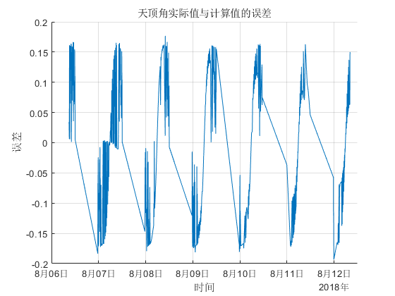

​	图上看误差大概也是**<u>-0.17~0.16</u>**，文献的误差范围给的是**<u>-0.0025~0.0027</u>**，差距是64倍左右，这个差距是很大的。

#### 分析一下8月7日

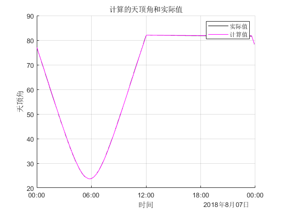

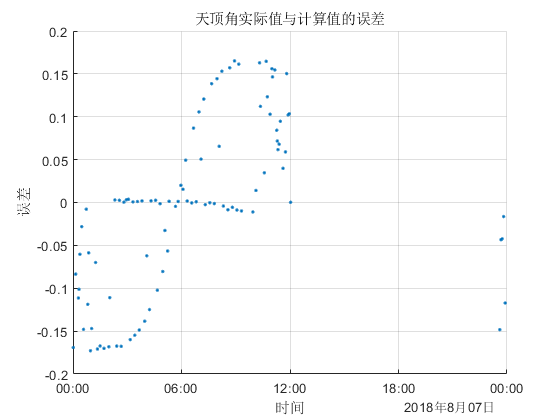

​	看了上面两张图，第一张其实看不出来什么，因为误差相对于测量角度的实际值差了100倍左右，能看出来的只是说一天中太阳天顶角是这么分布的。

​	第二张图和第一张图结合看其实是能看出来一点东西的，看到其实到了6点左右也是天顶角最小，这也是说明这时候高度角最大，太阳在比较高的地方，这时候计算的误差是小的，在00：00和12：00处误差也较大。

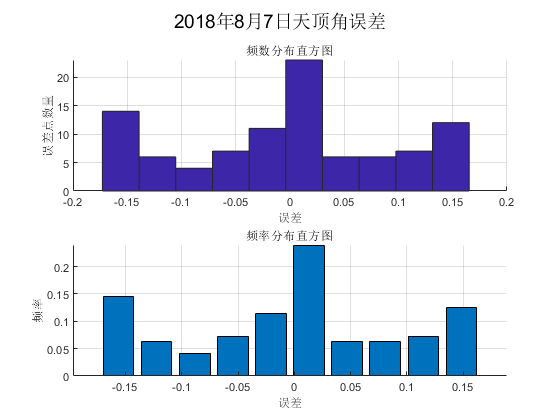

​	看了上面的三幅图，看到这些计算的结果，可以发现误差的分布也有点稀奇古怪，看不出来是什么类型的分布，因为我觉得数据的总数也不是很大，来计算的点数也不够多。可能这样子反应的规律也不是跟明确。总体上来看，还是误差小的占的比例大，所以可能这也是可以稍微有点欣慰的一件事吧。

## 总结

### 几种计算方法的结果

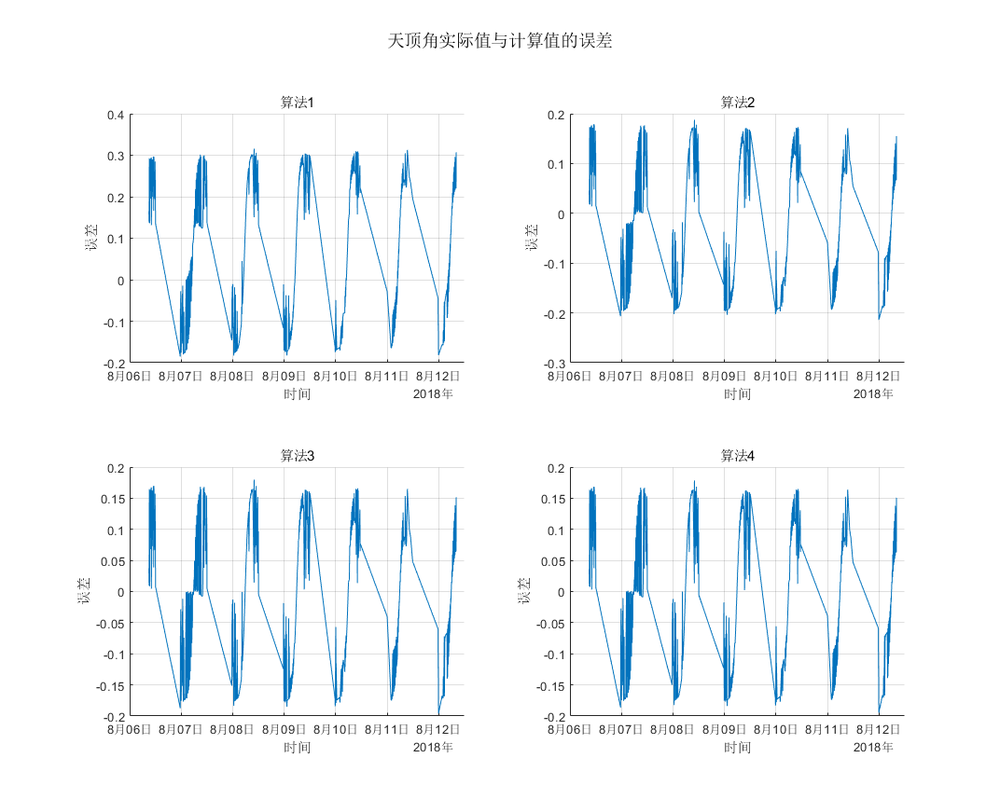

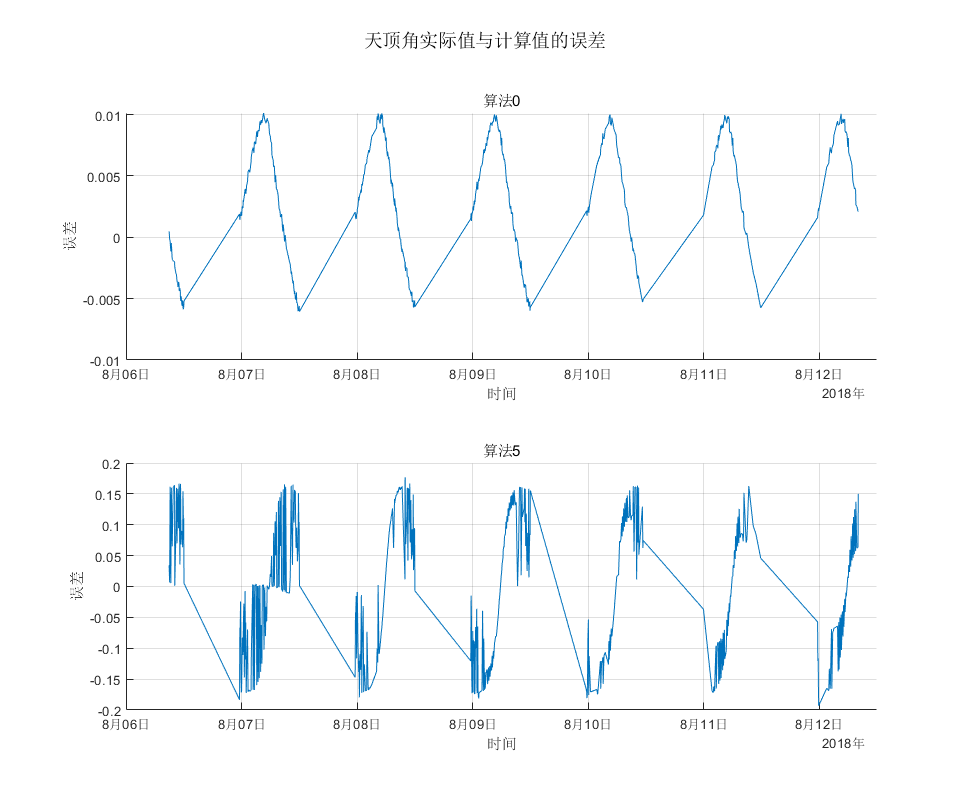

### 说明

| 算法 | 文献给的误差范围 | 计算的误差范围 | 相差倍数 |
| :--: | :--------------: | :------------: | :------: |
|  1   |   [-0.19,0.19]   |   [-0.2,0.3]   | 1.05~1.5 |
|  2   |  [-0,034,0.034]  |   [-0.2,0.2]   |   5.8    |
|  3   | [-0.0093,0.0092] |  [-0.17,0.17]  |   18.3   |
|  4   | [-0.0091,0.0093] |  [-0.17,0.17]  |   18.7   |
|  5   | [-0.0025,0.0027] |  [-0.16,0.16]  |   59.3   |

从这个表格中看出，几种计算出来的结果都在只能最高保证在0.16。

## 参考文献

[1] Roberto Grena  Five new algorithms for the computation of sun position from 2010 to 2110 Solar Energy

https://www.sciencedirect.com/science/article/pii/S0038092X12000400