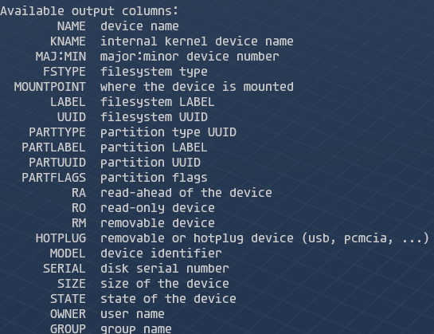

## Linux
### 通过文件系统
`rotational`为1代表可以旋转，为hdd，为0代表不能旋转，为ssd
位置在`/sys/block/sd*/queue/rotational`
```console
[root@dushenda home]# grep ^ /sys/block/sd*/queue/rotational  
/sys/block/sda/queue/rotational:1  
/sys/block/sdb/queue/rotational:1  
/sys/block/sdc/queue/rotational:1
```

### lsblk
```console
[root@dushenda home]# lsblk -o name,rota,VENDOR  
NAME ROTA VENDOR  
sda 1 Msft  
sdb 1 Msft  
sdc 1 Msft
```
`lsblk`可选行信息如下等，通过`lsblk --help`查看

### fdisk

## Windows

