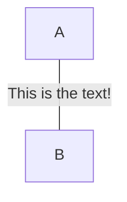
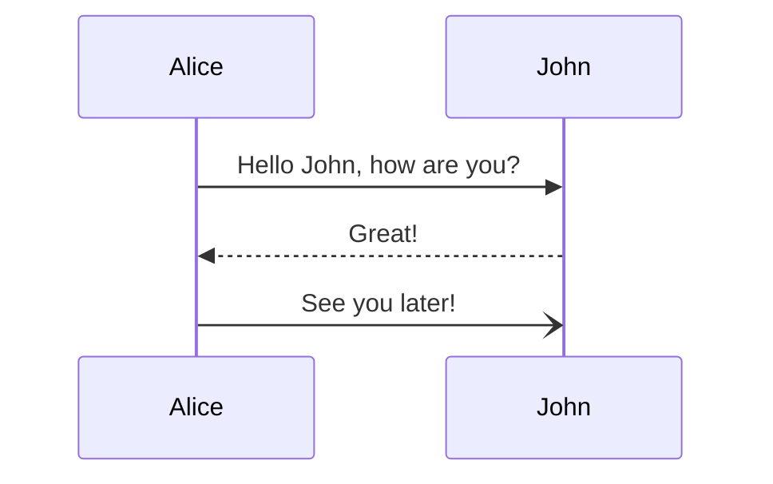

# \_config.next.yml文件
```
# Mermaid tag
mermaid:
  enable: true
  # Available themes: default | dark | forest | neutral
  theme:
    light: forest
    dark: dark
```


# 例子

```mermaid
flowchart

A-- This is the text! ---B
```


```mermaid
sequenceDiagram
Alice->>John: Hello John, how are you?
John-->>Alice: Great!
Alice-)John: See you later!
```


