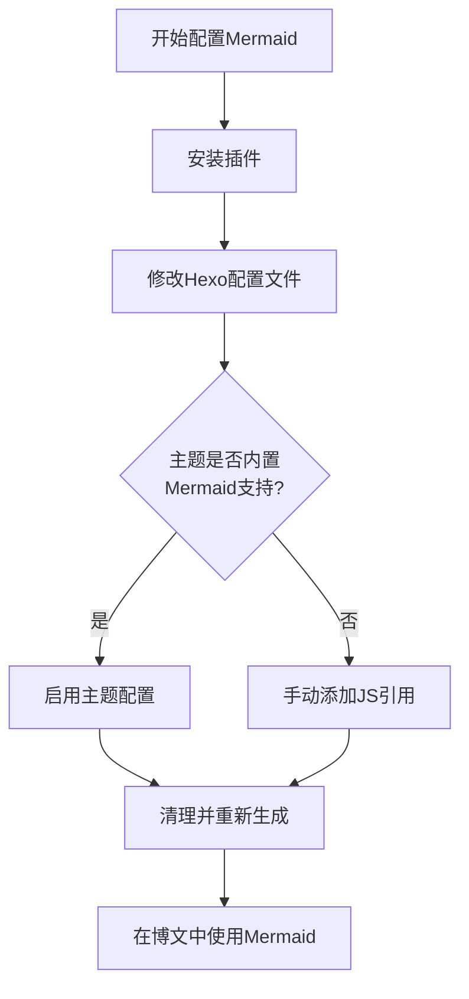

	
sequenceDiagram
Alice->>John: Hello John, how are you?
John-->>Alice: Great!
Alice-)John: See you later!
flowchart TD
Start --> Stop
id1(Some text)
id1[(Database)]
id1((Some text))


flowchart TD
Start --> Stop


````
```mehrmaid
graph LR
T1 --> T2 & T3 --> T4 & T5 --> T6

T1("")
T2("$\nabla_\theta \mathbb{E}_{\tau\sim p_\theta}[R(\tau)]x$")
T3("| First Name | Last Name |
| ---------- | --------- |
| Doug       | Engelbart |")
T4("#plugins/mehrmaid")
T5("[[mehrmaid]]")
T6("")
```
````


