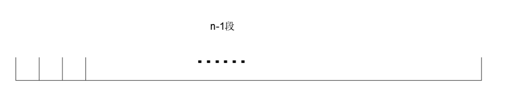

# 最大间隙问题

## 题目

对于输入的一组数，个数为 n ，求这 n 个数中大小相邻的两个数之间最大差。假设对于任何实数的下取整函数耗时都是 O(1) ，设计此问题的最大间隙解法。例如。

`input.txt`						`output.txt`

5								   0.8

1.1  1.3  2.5  0.7  2.1

其中这个几个数依次排列 0.7<1.1<1.3<2.1<2.5

可以看到，这几个相邻数字之间的差距最大在 2.1-1.3=0.8，所以求得这几个数字之间的最大间距是 0.8

## 思考

### 办法一

对于这个题目，首先我想到的也就是上面这个思路，首先要判断整个数组的两数相邻与否，那么我要做的就是将其排序，排序完，我再将其相邻数做差，那么也就是的都一个相邻两数的数组，得到数组之后，我就寻找数组中的最大元素，找到最大元素，再对应其索引，我就能找到那两个数字了。

但是，我立刻又想到了复杂度问题，因为排序算法的复杂度最低的是分治法，普通的搜索算法复杂度会比排序低的

复杂度计算如下
$$
O(n\log n)+O(n)+O(n)=O(n\log n)

O(n\log n) > O(n)
$$
​									<!--排序算法+做差+搜索-->
这个复杂度有点尴尬，因为他不是线性复杂度，不符合题目的要求，所以这个思路是不可行的。

那么我只能换其他的办法来做。

### 办法二

1. 设输入的是n个数，分别为 $a_1,a_2,...,a_n​$ ，设在这些数中最大的数为$a_{max}​$，最小的是$a_{min}​$；
2. 在$a_{max}$与$a_{min}$之间均匀插入$n-2$个等分点，将其分为$n-1$段，如下图；
   
3. 把需要剩下的$n-2$个数按照大小放入这$n-1​$个段中，根据鸽巢原理，那么其中必定有一个段是空的，如果有一个段是空的，那么我们就可以知道两个相邻数字之间的差值肯定是在两个段中的；
4. 计算每个段中的最大值最小值$low[i]$和$high[i]$，再使用后一段的$low[i+1]$减去前一段的$high[i]$，得到这些差值中的最大值就是相邻两数的最大间隙了。

分析一下复杂度，对于找最大最小值，也只需要遍历一次即可，所以复杂度为$O(n)​$，等分点只需要得到单位长度即可，单位长度为
$$
l=\frac{max-mix}{n-1}
$$
每个数要判断在哪个段里面也只需要知道自己跟起始处距离几个单位长度即可
$$
seg[i]=\frac{x[i]-minx}{l}+1
$$
数组$seg[i]$是一个纽带氏作用，它的索引与$x[i]$的数的索引是一样的，数组里面存储的数对于的第几个段。这个过程也是用这个公式就可以计算完成的，所以这个过程的复杂度也是$O(n)$，最后需要做差，使用$low[i+1]-high[i]$得到数组的间隙的最大值即可，最后这个过程的复杂吨也只需要$O(n)$。

根据前面的分析，每个过程的复杂度均为$O(n)$，那么有限个$O(n)$的累加复杂度还是$O(n)$，说明这个方法是可行的，满足题目要求。

## 伪代码

通过前面的分析，确定了方法二是可行的，那么就可以采用这个方法来进行伪代码书写。

```c++
//首先要求出最大值最小值。在这里求出它的索引，这样通过 x 数组访问就可得到它的值了
function maxi
maxi = 1;
for i=1:1:n
	if(x(i) > x[maxi])	maxi = i;
end
return maxi;

function mini
mini = 1;
for i=1:1:n
	if(x(i) > x[mini])	mini = i;
end
return mini;
//计算最大最小值，计算刻度，计算索引映射数据段数组 seg
maxx = x[maxi];minx = x[mini];
l = (maxx - minx)/(n-1);
for i=1:1:n
	seg[i] = (x[i] - minx)/l;
end
//初始化 low 和 high 数组
for i=0:1:n-2
```

