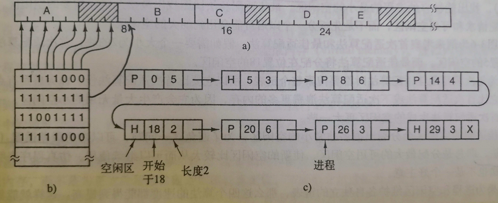
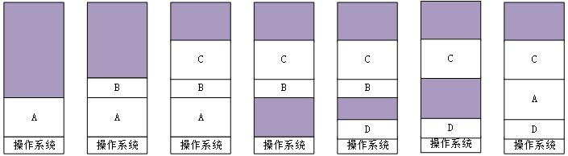
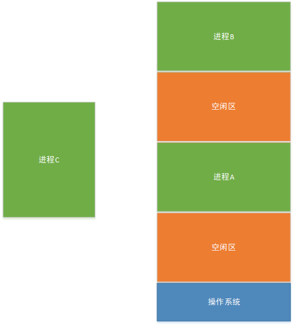
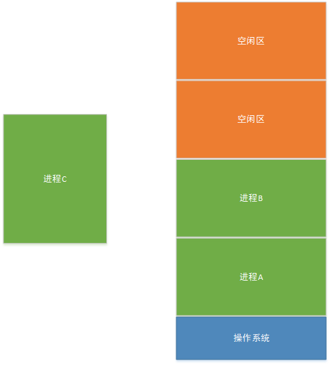

# 现代操作系统-内存管理1

## 空闲内存的管理

动态分配内存的时候（在进程需要动态扩张的时候），需要操作系统对其进行管理。

- 使用位图的存储器管理

  从上图可以看出，在内存中运行有A，B，C，D，E五个进程，阴影部分为空闲区。b)是对应的位图，首先堆内存进行分段，1表示有进程在运行，0表示处于空闲区。c)是空闲区链表的存储方式，其中P表示有进程在运行，0，5这样的数字说的是运行的段是从0到5。
  使用位图存储器就需要合适的选取刻度值，即对于整个内存的存储，如果刻度选的过小，就会导致位存储器过大，那么在查找和存储就会造成困扰。

- 使用链表的存储器管理
  如果使用一种链表式的存储，如c)所示，那么会显著减小存储，不这是一个单向链表，在查找的时候会比较慢。在进程状态改变的时候（如从内存中被导出等）就需要进行相应的链表操作。

## 覆盖与交换

覆盖与交换技术都是因为程序实际的需求的内存大小大于物理内存的大小产生的解决方案。他们都是与外存（如磁盘、硬盘等）进行程序与数据的交换。但是区别是交换是由操作系统完成的，交换的最小单元是程序，覆盖是由编程语言或者程序员完成的，导入导出的最小单元是程序中的模块，需要有相应的运行时支持。所以可以发现，交换的单个容量相对较大，并且不需要程序员过多的操心，覆盖的单个的容量相对较小，以程序的模块为单位。

|   技术   |                   优点                   |                   缺点                   |
| :------: | :--------------------------------------: | :--------------------------------------: |
| 交换技术 | 由操作系统完成，不需要程序员操心，自动化 | 交换力度过大，可能导致交换产生的开销过大 |
| 覆盖技术 |         交换力度小，产生的开销小         |       由程序员完成，不方便且易出错       |

### 交换技术

#### 交换过程

上图所示就是操作系统的内存交换过程，首先知道交换技术是进程在内存和外存之间的导入导出操作，主要原因是内存的容量不够，其中的A，B，C，D均为进程。

1. 运行进程A，进程A的程序和数据从头开始放
2. 之后运行进程B，此时进程A处于就绪状态，依旧存在于内存之中
3. 加载C进程，和前面的方法类似
4. 将进程A导出到外存，留下A部分的空闲区，也叫做洞
5. 加载D进程，这时候还是从头开始检测，发现空闲区可以容纳进程D
6. 杀死进程B
7. 从外存导入进程A，此时是空闲区刚好容纳A进程的大小

#### 内存紧缩

上述就是交换过程，其中有一个问题，那就是一个进程被导出之后留下了空闲区，空闲区的存在可能容纳不了下一个加载进程的大小。

这时候，就需要将进程B与进程A挪一挪，将其变成下面的状态。

这样的拷贝移动的过程称为内存紧缩。当然这种技术很不错，但是有一个问题，那就是开销，之前说到交换技术的最大的缺点是开销问题，开销是因为进程过于庞大，频繁移动他们需要很大的资源。

> 例如，一台16GB内存的计算机可以每8ns复制8个字节，那么其紧缩全部内存需要花费16s

这其实是很长的时间了，可以想象，经常使用内存紧缩是不合适的。

#### 动态分配

前面说到的进程好像就是一个进程导入内存就可以运行了，但是在很多情况下，进程需要接收输入，并且会进行一些处理，如果是数据增长，那么解决方法较为简单，因为数据位于数据段，可以直接由编程语言从堆中分配内存，还有一种情况是进程空间需要扩大，那么就需要操作系统在导入进程的时候预留一部分空间给进程，以应对其扩张。分配的大小是由操作系统需要的大小分配，即进程中所带的信息决定的，当其意外的超出了规定的大小并且磁盘上也没有多余的交换空间之后，那么该进程就会被挂起直到有一些空闲的空间。

### 覆盖技术

> 一个典型的SATA磁盘的峰值传输率高达每秒几百兆，这就意味着需要好几秒才能换出或者换入一个1GB的程序。

所以交换技术的开销问题确实是一个很致命的点。所以就出现了将程序分割，称为模块，将模块进行交换的技术，即覆盖技术

## 虚拟内存

从上面的交换技术和覆盖技术中可以看出，他们各自互补各自的优缺点。如果有一种技术，能够像覆盖那样导入导出小的模块，又能像交换那样由操作系统完成就优势互补了，这就是虚拟内存技术产生的原因了。

虚拟内存的思想是和覆盖类似，只不过将模块变成了页，页是对于程序的等大小的划分，这些页被映射到物理内存，并且由硬件直接运行。

> 从某个角度来说，虚拟内存是对基址寄存器和界限寄存器的一种综合。

由于涉及操作系统对页的自动操作，所以对于页的讨论还很多，留在下一篇再说。