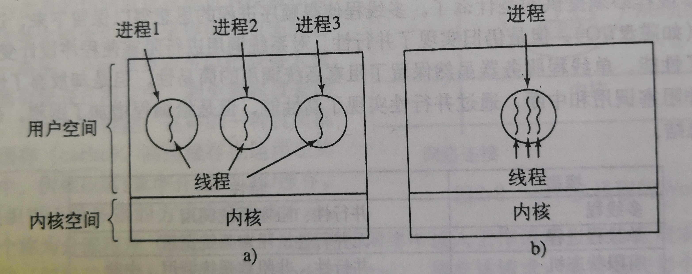

# 现代操作系统-进程与线程1~15

>  以下答案都是作者作答，不代表正确答案，望周知。

- - -

1. ##### 如图，对于每一个进程都有四种状态，照理应该有6种切换方式，但是为什么只有四种，为什么另外两种不行？

答：**从逻辑上来说，就绪态和运行态是类似的**，唯一的不同是在于是否得到CPU资源。如果从就绪态可以转换到阻塞态，那么出现的事件也就是需要等待输入，但是，就绪态就是因为已经出现了有效的输入只不过没有得到CPU资源而产生的等待，所以不可能出现就绪态向阻塞态的转变；从阻塞态到运行态是得到了有效的输入和CPU计算资源才能完成的转化，但是得到有效的输入肯定会位于得到资源的前面，因为没有有效的输入都不能进行计算，而当出现有效输入的时候，就已经是就绪态了，即使有效输入和CPU资源获取的间隔很小，但是始终存在，所以肯定会经过就绪态。

<!--more-->

2. ##### 假设要设计一种先进的计算机体系结构，它使用硬件替代中断来完成进程切换。进程切换时CPU需要哪些信息？请描述用硬件完成进程切换的工作过程。

首先需要知道，进程的管理是使用进程表来实现的。操作系统维护着一张表格，里面存储着各个进程的信息，是用结构数组实现的，每一个进程都占一个进程表项。所以管理进程也就是管理进程表，如果用硬件完成切换，首先需要有一个包含当前正在运行的进程的进程表项的指针，当当前进程从运行态转换到就绪态或者阻塞态的时候，将这部分信息存入进程表中，之后调度程序再加载下一个进程，并且更新该寄存器的指针值。P.S. 进程表和进程表项大概是这样的:

| 进程表 |
| ------ |
| 进程1  |
| 进程2  |
| 进程3  |
进程表项：
| 进程管理   | 存储管理   | 文件目录 |
| ---------- | ---------- | -------- |
| 寄存器     | 正文段指针 | 根目录   |
| 程序计数器 | 数据段指针 | 工作目录 |
| ...        | ...        | ...      |

3. ##### 当代计算机中，为什么中断处理程序至少有一部分的是由汇编语言写的？

答：因为要有部分功能需要直接访问硬件。

4. ##### 中断或系统调用把控制权交给操作系统的时候，为什么通常会用到与被中断进程的栈分离的内核栈？

答：这个问题的实质应该是问的为什么内核使用单独的堆栈而不是使用中断进程的堆栈。中断是由外部的用户进程产生的，用户进程和内核进程的重要程度和安全要求不一样，首先用户进程的堆栈有可能崩溃，如果将内核栈放在其中，会导致操作系统的崩溃，并且用户进程的堆栈是可以为用户读写的，如果将内核堆栈放在其中，则计算机系统可能会被某些恶意程序所劫持。

5. ##### 一个计算机系统的内存有足够的空间容纳5个程序。这些程序有一半的时间处于等待I/O的空闲状态。请问CPU时间浪费的比例是多少？

答：一个程序空闲的概率为$p=\frac{1}{2}$，要等到五个程序都空闲时候，CPU才不做任何计算，这时候处于空闲状态，这五个进程相互独立，则CPU的空闲（即浪费时间）为$p^5=\frac{1}{2^5}=\frac{1}{32}$。

- - -

6. ##### 一个计算机的RAM有4GB，其中操作系统占512MB，。所有进程占256MB（为了简化计算）并且特征相同。要使CPU利用率达到99%，最大I/O等待为多少？

答：首先要看懂所有进程占256MB这句话的意思，这是说每个进程都是256MB并且一样。先计算在4G内存下最多存在的进程数目$m=\frac{4GB-512MB}{256MB}=14$，说明最多有14个进程。设每个进程的I/O等待为$p$，则CPU的空闲率为$p^{14}$，并且要求占用率$\geq99\%$，所以有等式

$$
1-p^{14}\geq99\%
$$

计算得到$p\leq71.9\%$。

7. ##### 如果多个作业能够并行运行，会比他们顺序执行完成的快。假设有两个作业同时开始执行，每个需要20min的CPU时间。如果顺序执行，那么完成最后一个作业需要多长时间？如果并行执行，又需要多长时间？假设I/O等待占50%。

答：

如图所示，如果顺序执行，那么每个进程在输入需要10min，在输出需要10min，所以进行一个就需要40min的时间，共需要80min。

如果是并行执行，那么每个进程得到的CPU的利用率为$\frac{1-p^2}{2}=0.375$，每个进程本来在CPU利用率为1的时候需要20min，现在在CPU利用率为0.375的情况下需要时间为$\frac{20\min}{0.375}\approx53.3\min$，由于是并行执行，取其最大的即可，即$\max\{T_1,T_2,...T_n\}$，在这里两个进程的时间一样，所以运行的时间为53.3min。

8. ##### 考虑一个6级多道程序系统（内存中可同时容纳6个程序）。假设每个进程的I/O等待占40%，那么CPU的利用率是多少？

答：
$$
CPU_总=1-p^6=1-0.004096=0.995904,CPU_{每个}\frac{0.995904}{6}=0.16598
$$

9. ##### 假设要从互联网上下载一个2GB大小的文件，文件的内容可从一组镜像服务器获得，每个服务器可以传输文件的一部分。假设每个传输请求给定起始字节和结束字节。如何利用多线程优化下载时间？

答：客户机进程可以创建单独的线程；每个线程可以从一个镜像服务器获取文件的不同部分。这有助于减少停机时间。当然，所有线程都共享一个网络链接。当线程数量变得非常大时，此链接可能成为瓶颈。

10. ##### 为什么下图的模型不适合用于内存中使用高速缓存的文件服务器？每个进程可以有自己的高速缓存吗？

答：要牢记进程和线程在很多方面是类似的，线程可以理解为轻量级进程。但是最重要的区别是**进程共享存储空间**，共享存储空间说明他们操作的文件是一样的，所以将文件存于高速缓存是可以的。但是进程不同，操作的文件是不一样的，如果将其文件存于同一个缓存中，很可能前一个进程的文件就会被后一个进程的文件所覆盖。

- - -

11. ##### 当一个多线程进程创建子进程时，如果子进程复制父进程的所有线程，就会出现问题：假如父进程中有一个线程在等待键盘输入，那么当子进程复制父进程的时候，那么也会复制一个正在等待的等待键盘输入的子进程，那么当键盘输入的时候，父进程和子进程都会各有一个。这种问题在单线程进程中也会发生吗？

答：不会。如果单线程进程在键盘上阻塞，就不能创建子进程。（而多线程进程在一个线程阻塞时可以运行另一个线程，整个进程不会因此被阻塞。）

12. ##### 下图给了一个多线程Web服务器。如果读取文件只能使用阻塞的read系统调用，那么Web服务器应该使用用户级线程还是内核级线程？

答：当工作线程从磁盘读取Web页时，它就会被阻塞。如果使用用户级线程，该动作将阻塞整个进程，而破坏多线程的价值。这就是使用内核线程的原因：某些线程的阻塞不会影响到其他线程。

13. ##### 在本章中，我们介绍了多线程Web服务器，说明它比单线程服务器和有限状态机服务器更好的原因。存在单线程服务器更好一些的情形吗？请举例。

| 模型       | 特性                         |
| ---------- | ---------------------------- |
| 多线程     | 并行性、阻塞系统调用         |
| 单线程进程 | 无并行性、阻塞系统调用       |
| 有限状态机 | 并行性、非阻塞系统调用、中断 |

答：多线程，即可以并行执行多种工作，CPU的利用率高，而单线程进程和有限状态机在一个时刻只能执行一种工作，在切换线程的时候会造成I/O等待。比如有数据需要从web服务器输入输出，如果是多线程，那么可以在一个进程的情况下，一个线程实现数据的读入，一个处理线程和一个输出线程，这样相当于一个人打三份工，虽然累，但是不需要来回切换，一直在做。如果是单线程，那么需要不断切换，相当于几个人干不同的活，但是在交接的时候需要等待时间。这时候就没有在工作 。CPU就闲置了。

14. ##### 既然计算机中只有一套寄存器，为什么在图中的寄存器集合是按每个线程中列出而不是按每个进程列出。

答：当一个线程停止时，它在寄存器中有值。它们必须被保存，就像进程停止时，必须保存寄存器。多线程和多进程没有什么不同，所以每个线程需要自己的寄存器保存区。

15. ##### 在没有时钟中断的系统中，一个线程放弃CPU后可能再也不会获得CPU资源，那么为什么线程还要通过调用thread_yield自愿放弃CPU？

答：进程中的线程合作。它们彼此不敌对。如果应用程序需要阻塞以运行得更好，那么一个线程可以调用thread_yield自愿放弃CPU。毕竟，同一个进程中的线程的全部代码通常是一个程序员写的。

- - -