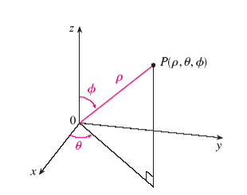

# 立体角
在谈立体角之前，我们先来复习一下球坐标及其面积分。

## 球面坐标系及积分

### 球坐标系

如上图所示，就是一个典型的球坐标系统，在坐标系中的每一点都可以使用$(\rho,\phi,\theta)$来描述，与笛卡尔坐标系之间的转化如下

$$
x=\rho\sin\phi\cos\theta\\
y=\rho\sin\phi\sin\theta\\
z=\cos\phi
$$

上式就是球坐标和笛卡尔坐标之间的转化，这个转化很容从图上看出来。

### 球面积分

从上图可以看出，面积的微元，长为$\rho d\phi$，因为这个方向上的长度为$\rho\phi$，所以微元为$\rho d\phi$；宽为$\rho\sin\phi d\theta$，这是因为首先要投影到$xy$平面，在这个平面上的长度为$\rho \sin\phi$，从图上可以看出，这个长度也就是宽，所以微元的宽为$\rho \sin\phi d\phi$。所以球面积分的微元面积$\rho^2 \sin\phi d\phi d\theta​$。

- 来看几个例子
  1. 球的表面积计算
     
     表面积的求法，就是对于微元而言，$\phi$的取值为$0$到$2\pi$，$\theta$的取值也是$0$到$2\pi$。$\rho$就是球的半径。
     所以微元$dS=\rho^2\sin\phi d\phi d\theta$。表面积的求法如下：
     $$
     S=\int_0^{2\pi}d\theta\int_0^{2\pi}\rho^2\sin\phi d\phi
     $$
     $\rightarrow 2\pi\rho^2(-\cos\theta)|^{2\pi}_0=4\pi\rho^2​$，这就是很熟悉的圆表面积计算公式了。$S_圆=4\pi r^2​$，这个公式应该在高中时候就经常使用了。

  2. 球帽表面积的计算
     

  蓝色部分就叫做球帽，计算这一部分的表面积。首先面积分的微元跟之前的一样，为$dS=\rho^2\sin\theta\phi d\phi d\theta$，不过这个图上的角度标的不太一样，那么改变一下，把$xy$平面的角度设为$\phi$，把与$z$轴之间的夹角设为$\alpha$。很容易从图上看出，$\phi\in[0,2\phi],\alpha\in[0,\theta]$，这边要注意这个$\alpha$，它的取值是从$z$轴为$0$，到$xy$平面为$\frac{\pi}{2}$。所以其表面积为

$$
S=\int_0^{2\pi}d\phi\int_0^{\theta}r^2\sin\theta d\theta
$$
​	$\rightarrow 2\pi r^2(-\cos\theta)|^{\theta}_0=2\pi r^2(1-\cos\theta)=2\pi r^2(1-\frac{r-h}{r})=2\pi rh​$，如果$h=r​$，那么求的是半球的面积，	面积$S=2\pi r^2​$，跟之前的球表面积也对上了。

- - -

球面坐标复习到这儿，下面就进入正题了。
## 立体角

### 角度

在介绍立体角之前，也先做个铺垫，讲一下角度。

如上图所示，平面角，简称角度定义为圆的弧长与半径之间的比值，单位为弧度($rad$)。
$$
\theta=\frac{l}{r}
$$

### 立体角

参考平面角的定义，立体角的定义为表面积与半径平方的比值，即

$$
\Omega=\frac{S}{r^2}
$$

反映的是从该点出发，向球面区域张成的视野大小，是平面角的三维扩展。

接上面计算的表面积的例子。

1. 球的立体角
   球的表面积为$S=4\pi r^2​$，球的半径为$r​$，立体角为$\Omega=\frac{S}{r^2}=4\pi​$，这也是最大的立体角。
2. 球帽的立体角
   球帽的表面积为$2\pi rh$，半径为$r$，立体角为$\Omega=\frac{S}{r^2}=2\pi h$。

需要注意的是，立体角计算也可以理解为是所形成表面在以原点为圆心的球的球面上的投影除以半径的平方。因为要计算的立体角表面不一定是球面的一部分，所以需要先投影到球面再进行计算。

