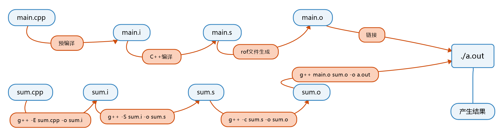

## 引子

先来看两段代码，这两段代码很简单。`main`是主函数，调用`sum`进行求和，其中`sum`函数参数是指针类型的，也就是说在`sum`函数进行改变会引起原来的值的改变。

```C++
//main.cpp
#include<iostream>

using namespace std;

int sum(int* a,int* b);

int main(int argc, const char** argv) {
    int k=-2;
    int j=-5;
    int* a;
    int* b;
    a = &k;
    b = &j;
    cout<<"k+j="<<sum(a,b)<<endl;
    cout<<"k="<<k<<"\t"<<"j="<<j<<endl;
    return 0;
}

```

```c++
//sum.cpp
#include<math.h>

int sum(int *a,int *b)
{
    *a = abs(*a);*b=abs(*b);
    return (*a+*b);
}
```

如果需要在`Linux`上面执行出结果，那么打上下面的代码就可以了：
```powershell
g++ main.c sum.cpp -o a.out
./a.out
```
输出的结果是：
```powershell
k+j=7
k=2	j=5
```

可以看到运行正确了，这个结果也是预料之中的，k 变成了 2，j 变成了 5，这个是在`sum`里面被改变了值，也会影响到原址的值。

## 程序到可执行文件

程序到可执行文件需要经过几个阶段：

### 预编译阶段
预编译阶段是把原始的代码文件的需要预编译头加进来，即对于`#include`的文件进行原样复制，`#include`文件可以由命令`locate`得到
```powershell
ubuntu@ubuntu:~/VSCode/CSAPP深入理解计算机系统$ locate iostream
/usr/include/c++/7/iostream
/usr/lib/x86_64-linux-gnu/libboost_iostreams.so.1.65.1
/usr/share/doc/libboost-iostreams1.65.1
/usr/share/doc/libboost-iostreams1.65.1/changelog.Debian.gz
/usr/share/doc/libboost-iostreams1.65.1/copyright
/usr/share/lintian/overrides/libboost-iostreams1.65.1
/var/lib/dpkg/info/libboost-iostreams1.65.1:amd64.list
/var/lib/dpkg/info/libboost-iostreams1.65.1:amd64.md5sums
/var/lib/dpkg/info/libboost-iostreams1.65.1:amd64.shlibs
/var/lib/dpkg/info/libboost-iostreams1.65.1:amd64.triggers
```
或者是对于C语言的库使用`man`
```powershell
man stdio
```
```powershell
STDIO(3)                   Linux Programmer's Manual                  STDIO(3)

NAME
       stdio - standard input/output library functions

SYNOPSIS
       #include <stdio.h>

       FILE *stdin;
       FILE *stdout;
       FILE *stderr;

DESCRIPTION
```
预编译命令如下：
```powershell
g++ -E main.cpp -o main.i
cat main.i
```
这个命令是把`main.cpp`$\rightarrow$`main.i`。
```c++
//部分代码，在Linux试一下就知道
namespace std __attribute__ ((__visibility__ ("default")))
{

# 60 "/usr/include/c++/7/iostream" 3
  extern istream cin;
  extern ostream cout;
  extern ostream cerr;
  extern ostream clog;


  extern wistream wcin;
  extern wostream wcout;
  extern wostream wcerr;
  extern wostream wclog;


  static ios_base::Init __ioinit;


}
# 2 "main.cpp" 2


# 3 "main.cpp"
using namespace std;

int sum(int* a,int* b);

int main(int argc, const char** argv) {
    int k=-2;
    int j=-5;
    int* a;
    int* b;
    a = &k;
    b = &j;
    cout<<"k+j="<<sum(a,b)<<endl;
    cout<<"k="<<k<<"\t"<<"j="<<j<<endl;
    return 0;
}
```
可以看到，这就是把`#include`里面的东西原样复制到`main.cpp`代码文件里面，整合到一起，就叫做预编译过程。
### C++编译阶段
C++编译阶段就是把预编译好的文件编译成汇编代码，个人觉得这个过程跟翻译差不多，把一种语言翻译成另一种语言，命令如下。
```powershell
g++ -S main.i
cat main.s
```
上面的`g++`命令默认会有`-o main.s`添加上，即会产生`main.s`文件产生。
产生的`main.s`文件如下，由于太长，截取了部分。

```asm
	.file	"main.cpp"
	.text
	.section	.rodata
	.type	_ZStL19piecewise_construct, @object
	.size	_ZStL19piecewise_construct, 1
_ZStL19piecewise_construct:
	.zero	1
	.local	_ZStL8__ioinit
	.comm	_ZStL8__ioinit,1,1
.LC0:
	.string	"k+j="
.LC1:
	.string	"k="
.LC2:
	.string	"\t"
.LC3:
	.string	"j="
	.text
	.globl	main
	.type	main, @function
main:
.LFB1493:
	.cfi_startproc
	pushq	%rbp
	.cfi_def_cfa_offset 16
	.cfi_offset 6, -16
	movq	%rsp, %rbp
	.cfi_def_cfa_register 6
	pushq	%rbx
	subq	$56, %rsp
	.cfi_offset 3, -24
	movl	%edi, -52(%rbp)
	movq	%rsi, -64(%rbp)
	movq	%fs:40, %rax
	movq	%rax, -24(%rbp)
	xorl	%eax, %eax
	movl	$-2, -48(%rbp)
	movl	$-5, -44(%rbp)
	leaq	-48(%rbp), %rax
	movq	%rax, -40(%rbp)
	leaq	-44(%rbp), %rax
	movq	%rax, -32(%rbp)
	leaq	.LC0(%rip), %rsi
	leaq	_ZSt4cout(%rip), %rdi
	call	_ZStlsISt11char_traitsIcEERSt13basic_ostreamIcT_ES5_PKc@PLT
	movq	%rax, %rbx
	movq	-32(%rbp), %rdx
	movq	-40(%rbp), %rax
	movq	%rdx, %rsi
	movq	%rax, %rdi
	call	_Z3sumPiS_@PLT
	movl	%eax, %esi
	movq	%rbx, %rdi
	call	_ZNSolsEi@PLT
	movq	%rax, %rdx
	movq	
```

从上面的代码看出，这是个汇编代码，也就完成了`main.i`$\rightarrow$`main.s`的转化。

### 汇编代码转化为rof文件
`rof`是relocatable object file的简称，称为可重定向目标文件。

```powershell
g++ -c main.s
```
输出的文件为`main.o`，这个文件不是文本文件，是一个二进制文件。

> 文本文件：由ASCII码组成的文件，可以由文本编辑器直接打开
> 二进制文件：除了文本文件之外的所有文件，如图片格式文件就属于二进制文件，这种文件需要专门的解码软件打开，如果使用文本编辑器打开就是乱码的。

### 链接器链接生成eof
`eof`是executable object file的简称，称为可执行目标文件。

按照前面的步骤（预编译$\rightarrow$C++编译$\rightarrow​$rof文件生成）得到`sum.o`文件。然后进行：

```powershell
g++ main.o sum.o
```
这时候会产生一个新的文件为`a.out`，这个名字可以自己取，也就是把默认的那个语句加上，如：
```powershell
g++ main.o sum.o -o main.out
```
当然，在 Linux 里面文件的后缀名是不重要的，`.x`也可，只不过`.out`是在Unix操作系统上第一个实现的可执行文件的后缀名，就保留了下来。

之后就运行：
```powershell
./a.out
```
得到结果
```powershell
k+j=7
k=2	j=5
```
这个结果跟之前的一致。执行命令的时候，Linux 会使用它的加载器将可执行文件`a.out`的代码和数据复制到内存，然后将控制转移到这个程序的开头。

### 小结



## 可执行文件格式分析