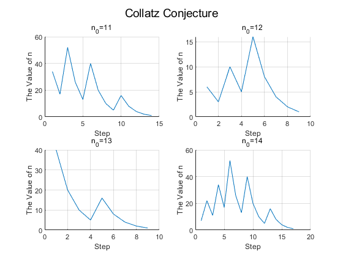
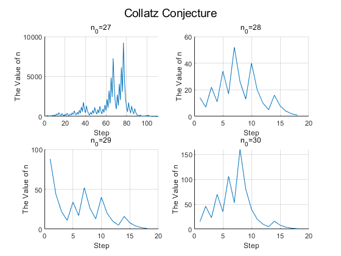
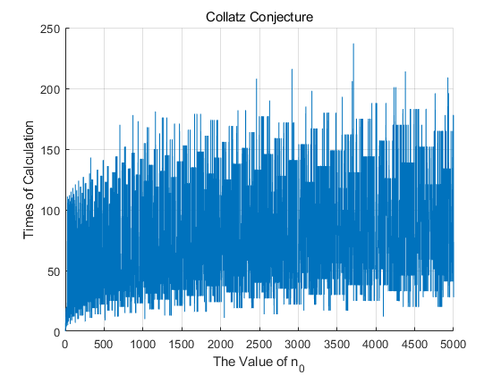

# 考拉兹猜想

## 考拉兹猜想定义

考拉兹函数定义如下

$$
f(x)=\left\{
\begin{array}{**lr**}
3n+1&x为奇数且x\neq1\\
n/2&x为偶数\\
1&x=1
\end{array}
\right.
$$
通过对 $x$ 取不同的值，发现最后都会收敛到 1。求该函数构成算法的上下界。

当然，下界是很容易求出来的，如果输入 $n$ ，下降最快的也就是每次下降  $\frac{1}{2}$，这个下降速度对于的计算时间是 $\log n$ 。对于上界，用 $MATLAB​$ 带入一些数值计算。得到的结果如下：

## 部分 $n_0$ 的步长与 $n$ 值变化

## $n_0$ 与计算次数分布曲线

